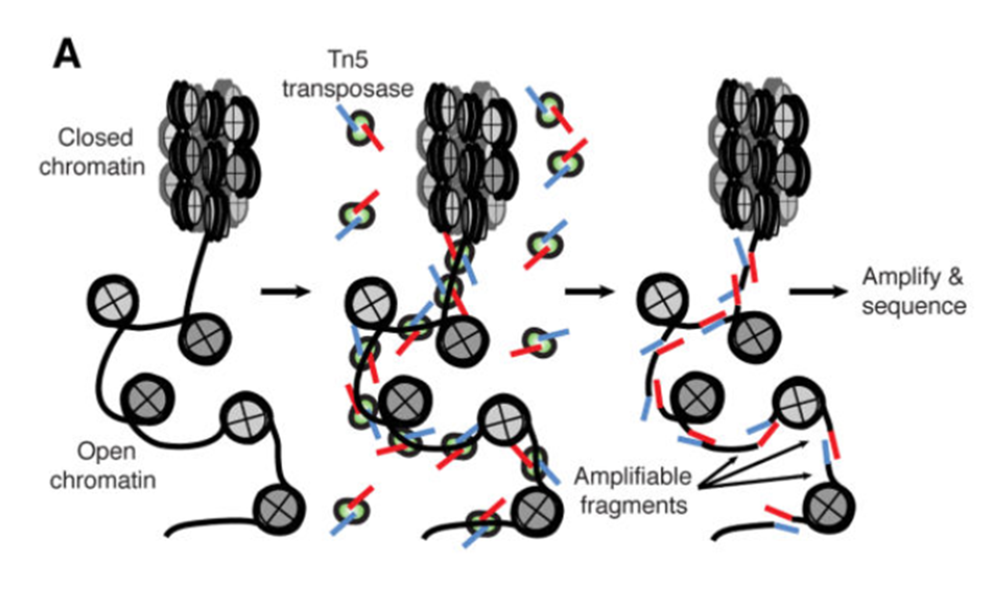
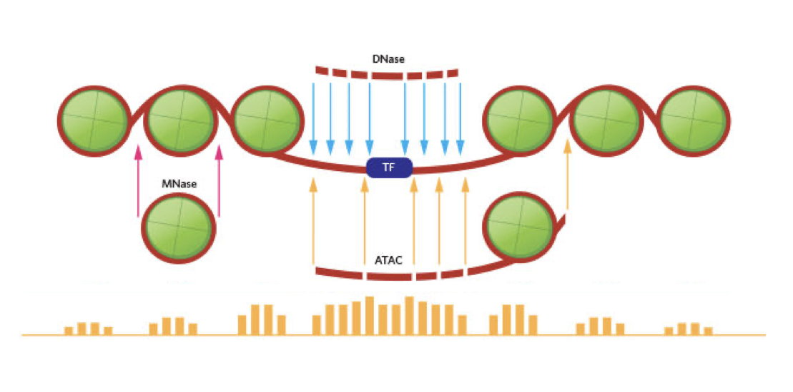

```{=html}
<!-- 
Author:         Agata Smialowska
About:          This qmd file is used to render the .html file. To modify or 
                update the .html file, please do so in the .qmd file here and 
                render it.
-->
```

<br />
<br />

ATAC-seq (Assay for Transposase-Accessible Chromatin with high-throughput sequencing) is a method for determining chromatin accessibility across the genome. It utilizes a hyperactive Tn5 transposase to insert sequencing adapters into open chromatin regions [@Buenrostro2015]. The principle of the assay is presented on Figure 1. High-throughput sequencing yields reads that indicate the regions of increased accessibility (Figure 2).

{width=70%}

<br />
<br />

{width=70%}

<br />
<br />


<br />


::: {#fig-flowchart-1}


```{mermaid}
%%| label: fig-mermaid-flowchart1
%%| fig-width: 6
%%| echo: FALSE

flowchart LR
  subgraph QC
    D(Quality Control, Feature Agnostic)
    H(Quality Control, Feature Focused)
  end
  subgraph Analysis
    C(Feature Detection)
    E(Feature Annotation)
    F(Statistical Analysis)
    E(Feature Annotation)
  end

  A[Data] --> B([Data Processing])
  B([Data Processing]) --> C(Feature Detection)
  B([Data Processing]) --> D(Quality Control, Feature Agnostic)
  C(Feature Detection) --> E(Feature Annotation)
  C(Feature Detection) --> F(Statistical Analysis)
  C(Feature Detection) --> G(Visualisation)
  B([Data Processing]) --> G(Visualisation)
  E(Feature Annotation) --> I{Analysed}
  F(Statistical Analysis) --> I{Analysed}
  D(Quality Control, Feature Agnostic) --> H(Quality Control, Feature Focused)
  C(Feature Detection) --> H(Quality Control, Feature Focused)
  G(Visualisation) --> I{Analysed}
  H(Quality Control, Feature Focused) --> I{Analysed}

  style A fill:#8FB4F7,stroke:#2768F5
  style I fill:#DF8FF7,stroke:#C11DF2
  style QC fill:#D4D1C5,stroke:#87857C 
  style Analysis fill:#D4D1C5,stroke:#87857C 

```

ATAC-seq data analysis workflow.
:::

<br />
<br />
<br />


## ATAC-seq tutorials

<br />
<br />


Tutorials in this module:

* [Data Processing and QC](../../tutorials/ATACprocessing/index.html)

* [Peak Detection](../../tutorials/ATACpeakAnnot/index.html)

* [Differential Accessibility](../../tutorials/ATACda/index.html)

* [Peak Annotation](../../tutorials/ATACpeakAnnot/index.html)


<br />
<br />

Additional ATAC-seq related tutorials:

* [TF motifs](../../tutorials/TFs/representingMotifs.html)

* [Identifying Relevant TFs](../../tutorials/TFs/representingMotifs.html)


<br />
<br />

## References


