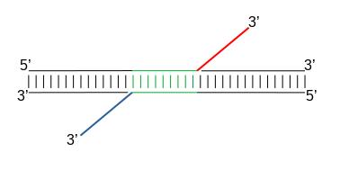
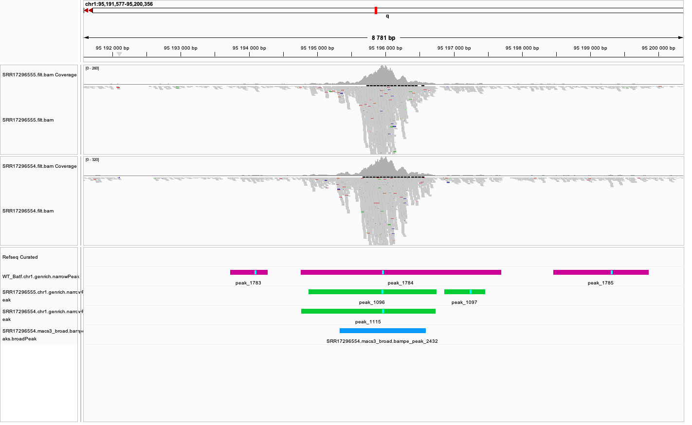
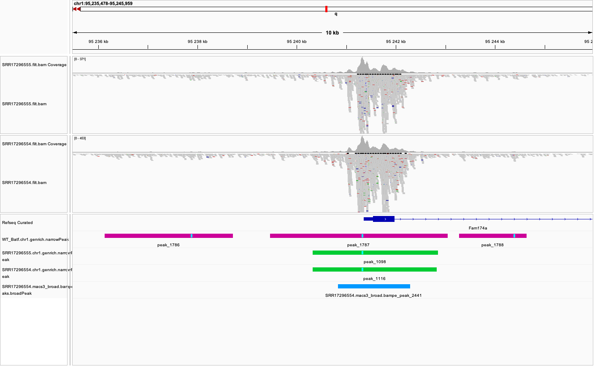
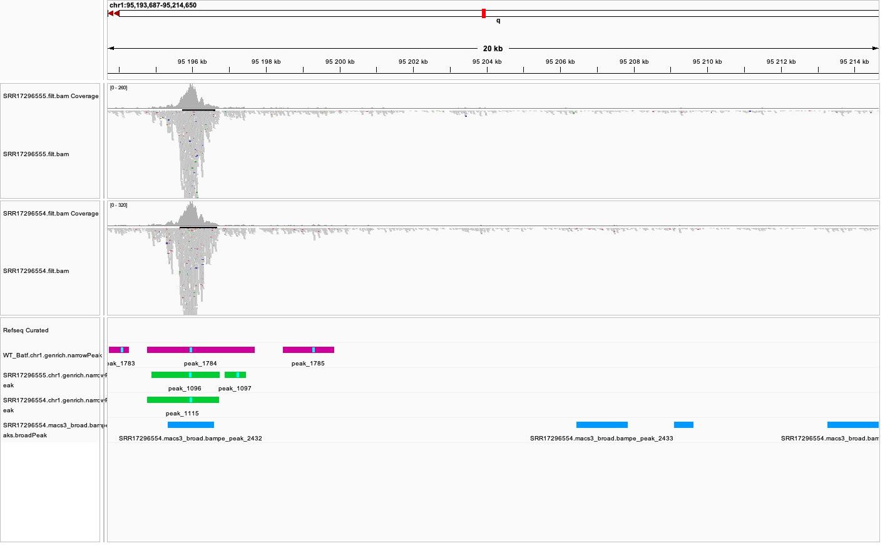
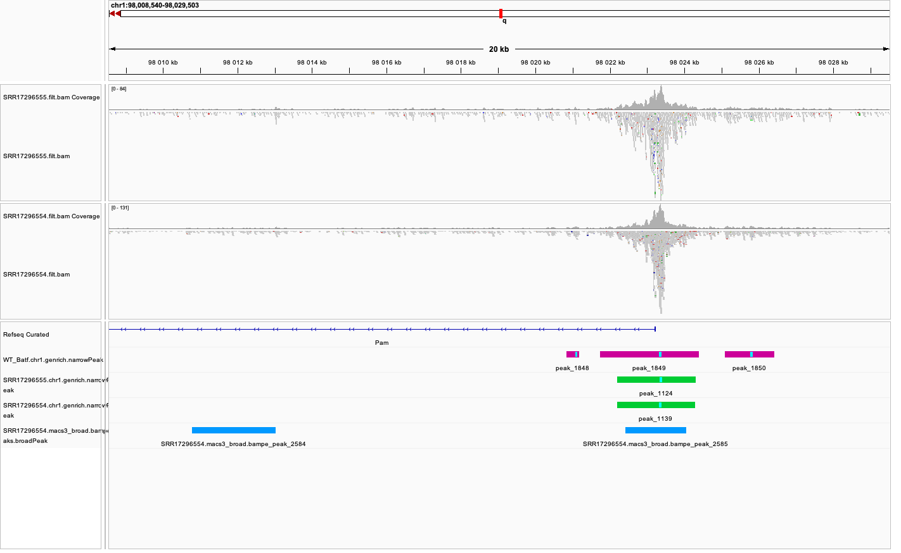

```{r echo=FALSE,include=FALSE,cache=FALSE}
library(knitr)

knitr::opts_chunk$set(echo = FALSE, 
                      collapse = TRUE, 
                      warning = FALSE, 
                      message = FALSE,
                      include=TRUE,
                      cache=FALSE,
                      out.width = "99%")

options(knitr.duplicate.label = "allow")

```

<br />

## Learning outcomes


* identify peaks in ATAC-seq data using different methods

* calculate fraction of reads in peaks

* generate counts table


<br />
<br />


::: {.callout-note collapse="false"}

### Note on this workflow

  We continue working with data from [@Tsao2022]. We will use data subset to include alignments to chromosome 1 and 1% of reads mapped to chromosomes 2 to 5 and MT.

  This tutorial is a continuation of [Data processing and QC](../ATACprocessing/index.html).

:::

<br />
<br />

::: {.callout-important collapse="false"}

  We assume that the environment and directory structure has been already set in [Data processing and QC](../ATACprocessing/index.html).

:::

<br />
<br />


## Data


We will use data that come from publication `Batf-mediated epigenetic control of effector CD8+
T cell differentiation` (Tsao et al 2022). These are **ATAC-seq** libraries (in duplicates) prepared to analyse chromatin accessibility status in murine CD8+ T lymphocytes prior to and upon Batf knockout.

The response of naive CD8+ T cells to their cognate antigen involves rapid and broad changes to gene expression that are coupled with extensive chromatin remodeling. Basic leucine zipper ATF-like transcription
factor **Batf** is essential for the early phases of the process.


SRA sample accession numbers are listed in Table 1.


::: {.list-table}
   - - No
     - Accession
     - Sample Name
     - Description
   - - 1
     - SRR17296554
     - B1_WT_Batf-floxed_Cre_P14
     - WT Batf
   - - 2
     - SRR17296555
     - B2_WT_Batf-floxed_Cre_P14
     - WT Batf
   - - 3
     - SRR17296556
     - A1_Batf_cKO_P14
     - KO Batf
   - - 4
     - SRR17296557
     - A2_Batf_cKO_P14
     - KO Batf

Table 1. Samples used in this tutorial.
:::


<br />
<br />


## Peak Calling

To find regions corresponding to potential open chromatin, we want to identify ATAC-seq "peaks" where reads have piled up to a greater extent than the background read coverage.

The tools which are currently used in major processing pipelines are [Genrich](<https://github.com/jsh58/Genrich>) and [MACS3](https://github.com/macs3-project/MACS). 

* **Genrich** has a mode dedicated to ATAC-Seq (in which it creates intervals centered on transposase cut sites); it can leverage biological replicates in calculating significance; however, Generich is still not published;

* **MACS3** has more ATAC-seq oriented features than its predecessor MACS2, however, its main algorithm for peak detection is oriented towards peak calling in ChIP-seq experiments and does not take into account unique features of ATAC-seq data.


<br />
<br />


<!-- In this tutorial we will use Genrich and MACS3. We will compare the results of peaks detected by Genrich and by MACS3, as used in major data processing pipelines (nf-core, ENCODE). -->


<br />
<br />


### Shifting Alignments


We have already discussed this step in the [QC](../ATACprocessing/index.html#quality-control-for-atac-seq). tutorial. Briefly, the alignments are shifted to account for the duplication created as a result of DNA repair after Tn5-introduced DNA nicks.


When Tn5 cuts an accessible chromatin locus, it inserts adapters separated by 9bp, see @fig-nextera. This means that to have the read start site reflect the centre of where Tn5 bound, the reads on the **positive strand** should be **shifted 4 bp to the right** and reads on the **negative strand** should be **shifted 5 bp to the left** as in [@Buenrostro2013].

<br />

::: {#fig-nextera}



Nextera library construction.
:::

<br />

**To shift or not to shift?** It, as always, depends on the downstream application.

If we use the ATAC-seq peaks for **differential accessibility**, and especially if we detect the peaks in the `MACS3 broad` mode, then shifting does not play any noticeable role: the "peaks" are hundred(s) of bps long, reads are summarised to these peaks / domains allowing a partial overlap, so 9 basepairs of difference in read position has a neglibile effect. 

However, when we plan to use the data for any **nucleosome-centric analysis** (positioning at TSS or TF footprinting), shifting the reads allows to center the signal in peaks flanking the nucleosomes and not directly on the nucleosome. Typically, applications used for these analyses perform the read shifting, so we do not need to preprocess the input bam files.

<br />


**More on peak calling** and **which parameters to choose**. Historically, ATAC-seq data have been analysed by software developed for ChIP-seq, even though the two assays have different signal structure. The peak caller most widely used has been MACS2/3 (as evidenced by number of citations), with a wide range of parameters. The discussion on why not all these parameter choices are optimal can be found in [@Gaspar2018]. Some examples are listed in [MACS3 documentation](https://macs3-project.github.io/MACS/docs/callpeak.html).


<br />
<br />


### Genrich


We start this tutorial in directory `atacseq/analysis/`:

<br />

```{bash}
#| eval: FALSE
#| echo: TRUE

mkdir peaks
cd peaks
```
<br />

We need to link necessary files first:

<br />

```{bash}
#| eval: FALSE
#| echo: TRUE

mkdir genrich
cd genrich

# we link the pre-processed bam file
ln -s ../../../data_proc/SRR17296554.filt.chr1.bam
ln -s ../../../data_proc/SRR17296554.filt.chr1.bam.bai

# because we want to use the other replicate for peak calling, we link its files as well
ln -s ../../../data_proc/SRR17296555.filt.chr1.bam
ln -s ../../../data_proc/SRR17296555.filt.chr1.bam.bai

```
<br />

In these files, we removed all reference sequences other than chr1 from the bam header, as this is where our data is subset to. Genrich uses the reference sequence length from bam header in claculating the statistical significance, so retaining the original bam header would impair peak calling statistics.


Genrich requires bam files to be **name-sorted** rather than the default coordinate-sorted. 

<br />

```{bash}
#| eval: FALSE
#| echo: TRUE

# in case not already loaded
module load SAMtools/1.19.2-GCC-13.3.0

# sort the bam file by read name (required by Genrich)
samtools sort -n -o SRR17296554.filt.chr1.nsort.bam  SRR17296554.filt.chr1.bam
samtools sort -n -o SRR17296555.filt.chr1.nsort.bam  SRR17296555.filt.chr1.bam
```
<br />


Genrich can apply the read shifts when the ATAC-seq mode `-j` is selected. We detect peaks by:

<br />

```{bash}
#| eval: FALSE
#| echo: TRUE

genrich="/proj/epi2026/library/Genrich/Genrich"

$genrich -j -t SRR17296554.filt.chr1.nsort.bam  -o SRR17296554.chr1.genrich.narrowPeak
```
<br />


The output file produced by Genrich is in [ENCODE narrowPeak format](https://genome.ucsc.edu/FAQ/FAQformat.html#format12), 
listing the genomic coordinates of each peak and various statistics.

The interpretation of each field is given in [Genrich documentation](https://github.com/jsh58/Genrich#io-files-and-options):

<br />

```{bash}
#| eval: FALSE
#| echo: TRUE

chr start end name score strand signalValue pValue qValue peak
```

* `signalValue` - Measurement of overall (usually, average) enrichment for the region.

* `pValue` - Measurement of statistical significance (-log10). `-1` if no pValue is assigned.

* `qValue` - Measurement of statistical significance using false discovery rate (-log10). `-1` if no qValue is assigned.

<br />

How many peaks were detected?

<br />

```{bash}
#| eval: FALSE
#| echo: TRUE

wc -l SRR17296554.chr1.genrich.narrowPeak
2860 SRR17296554.chr1.genrich.narrowPeak
```
<br />


::: {.callout-note collapse="true"}

### SRR17296554.chr1.genrich.narrowPeak

You can inspect file contents:

<br />

```{bash}
#| eval: FALSE
#| echo: TRUE

head SRR17296554.chr1.genrich.narrowPeak

1 4566396 4566996 peak_0  874 . 524.450012  4.083697  -1  295
1 4818047 4818755 peak_1  739 . 523.147156  3.863627  -1  476
1 4855285 4856526 peak_2  1000  . 2765.520264 7.476175  -1  601
1 4877542 4879096 peak_3  1000  . 2765.986816 6.540341  -1  573
1 4927128 4929149 peak_4  1000  . 4235.729492 7.914668  -1  868
1 5152781 5154166 peak_5  1000  . 2653.163330 7.412836  -1  556
1 6283374 6283786 peak_6  549 . 226.311874  3.085280  -1  279
1 6284256 6285987 peak_7  1000  . 4862.475098 7.119522  -1  913
1 6452823 6453287 peak_8  579 . 268.770874  3.621369  -1  280
1 6476302 6477424 peak_9  1000  . 1561.405884 6.319389  -1  506

```
<br />

:::


We can now process the remaining replicate:

<br />

```{bash}
#| eval: FALSE
#| echo: TRUE

$genrich -j -t SRR17296555.filt.chr1.nsort.bam  -o SRR17296555.chr1.genrich.narrowPeak

```
<br />

Genrich can also call peaks for *multiple replicates collectively*. First, it analyzes the replicates separately, with p-values calculated for each. At each genomic position, the multiple replicates' p-values are then combined by Fisher's method. The combined p-values are converted to q-values, and resulting peaks are saved to a file.

<br />
<br />

For comparison, use the joint replicate peak calling mode:

<br />
```{bash}
#| eval: FALSE
#| echo: TRUE

$genrich -j -t SRR17296554.filt.chr1.nsort.bam,SRR17296554.filt.chr1.nsort.bam \
   -o WT_Batf.chr1.genrich.narrowPeak
```

<br />

How many peaks were detected by Genrich?

<br />

```{bash}
#| eval: FALSE
#| echo: TRUE

wc -l *narrowPeak
    
2860 SRR17296554.chr1.genrich.narrowPeak
2791 SRR17296555.chr1.genrich.narrowPeak
4661 WT_Batf.chr1.genrich.narrowPeak

```
<br />

It turns out `Genrich` detected more peaks in the joint mode, including in locations not picked up in neither of the individual sample command runs. Some of these locations have been also detected by `MACS3 callpeak`, see figures below.
We can conclude that adding more replicates improves the sensitivity of peak calling, the basis of which are discussed in [Genrich documentation](https://github.com/jsh58/Genrich#multiple-replicates).
Upon inspection of alignments in bam files and peak calls, many of the peaks called only in joint replicate analysis tend to have lower signal-to-noise ratio than peaks detected also in individual replicates. 


<br />
<br />

### MACS


<br />
<br />

As mentioned in the introduction, MACS has been used with a variety of parametr choices to detect peaks in ATAC-seq data.
You can encounter various combinations of read input modes (BAM, BAMPE, BED and BEDPE; BED / BAM designated for SE data used also for PE data), and peak calling modes (default "narrow" and optional "broad"). Some protocols shift reads (setting options `extsize` and `shift`) with the intention of centring reads on the Tn5 cut site and extending by desired length to obtain enough coverage for peak calling.


#### MACS3 broad peak

Here we choose the simplest approach: detection of regions with signal higher than expected (background modelled by Poisson distribution) in fragment pileups. Such approach is used as default in some popular ATAC-seq data processing pipelines, e.g. [nf-core atacseq](https://nf-co.re/atacseq/2.1.2).


First, we create a separate directory for results obtained using *MACS3:


<br />

```{bash}
#| eval: FALSE
#| echo: TRUE

mkdir -p ../macs3
cd ../macs3
```
<br />

We are now ready to call the peaks using `macs3 callpeak`. We will use the same starting file as for Genrich, and the genome size of **195154279** (length of chr 1).


<br />

```{bash}
#| eval: FALSE
#| echo: TRUE

ln -s ../../../data_proc/SRR17296554.filt.chr1.bam

topdir="/proj/epi2026/"
contdir="/proj/epi2026/library/containers"

MACS3="apptainer exec --bind $(pwd) --bind ${topdir} --pwd $(pwd) ${contdir}/macs3:3.0.4.img macs3"

$MACS3 callpeak --keep-dup all --nomodel --broad --broad-cutoff 0.1 -g 195154279 -f BAMPE -t SRR17296554.filt.chr1.bam -n SRR17296554.macs3_broad.bampe

```
<br />


How many peaks were detected?


<br />

```{bash}
#| eval: FALSE
#| echo: TRUE

wc -l SRR17296554.macs3_broad.bampe_peaks.broadPeak
6668 SRR17296554.macs3_broad.bampe_peaks.broadPeak

```
<br />

We can see that the peak numbers are in the same ballpark, as for Genrich. We expect that some calls will be different, but more or less these results seem to go in line with each other.

<br />
<br />

Figures below (@fig-peaks-igv) use the same colour scheme, tracks from top:


* processed bam files with coverage

* gene models (indigo)

* Genrich (dark magenta), peaks called on joint replicates

* Genrich (green), peaks for replicate 1

* Genrich (green), peaks for replicate 2

* macs3 callpeak (blue), broad peak, BAMPE, replicate 1

<br />


::: {#fig-peaks-igv layout-ncol=1}

{width=95%}

{width=95%}

{width=95%}

{width=95%}

Comparison of peaks detected by `Genrich` and `MACS3 callpeak broad`.
:::


<br />

Upon inspecting the tracks, we notice that while the peaks with high signal-to-noise ratio are identifed by both methods (MACS3 broad BAMPE and Genrich), some peaks are detected by single method. 
In this data set some of the peaks detected by MACS3 seem to correspond less well to data evidence (read coverage).

This highlights the need to always inspect the data and peak calls. In many cases spurious calls may be mitigated by filtering or a strategy to select *consensus peak set*.


<br />
<br />


### Fraction of Reads in Peaks

<br />

**Fraction of Reads in Peaks (FRiP)** is one of key QC metrics of ATAC-seq data. According to [ENCODE ATACseq data standards](https://www.encodeproject.org/atac-seq/#standards) 
acceptable FRiP is >0.2. Intuitively, this value depends on the peak detection protocol, and as we have seen in the previous section, the results of peak calling may vary ...a lot. 
However, it is worth to keep in mind that any samples which show different value for this (and other) metric may be technical outliers problematic in the analysis.

To calculate FRiP we need alignments file (`bam`) and peak file (`narrowPeak`, `bed`).

Assuming we are in `peaks`:


```{bash}
#| eval: FALSE
#| echo: TRUE

mkdir frip
cd frip
```

<br />

We will use a tool called `featureCounts` from package `Subread` [@pmid24227677]. This tool accepts genomic intervals in formats `gtf/gff` and `saf`. Let's convert `narrow/ broadPeak` to `saf`. Is's a text manipulation, and requires only selecting and reordering the columns, while renaming and renumbering the peaks.


<br />

```{bash}
#| eval: FALSE
#| echo: TRUE

ln -s ../genrich/SRR17296554.chr1.genrich.narrowPeak

awk -F $'\t' 'BEGIN {OFS = FS}{ $2=$2+1; peakid="genrich_Peak_"++nr;  print peakid,$1,$2,$3,"."}' SRR17296554.chr1.genrich.narrowPeak > SRR17296554.chr1.genrich.saf

```
<br />

::: {.callout-note collapse="true"}

### SRR17296554.chr1.genrich.saf


```{bash}
#| eval: FALSE
#| echo: TRUE

genrich_Peak_1  1 4566397 4566996 .
genrich_Peak_2  1 4818048 4818755 .
genrich_Peak_3  1 4855286 4856526 .
genrich_Peak_4  1 4877543 4879096 .
genrich_Peak_5  1 4927129 4929149 .
genrich_Peak_6  1 5152782 5154166 .
genrich_Peak_7  1 6283375 6283786 .
genrich_Peak_8  1 6284257 6285987 .
genrich_Peak_9  1 6452824 6453287 .
genrich_Peak_10 1 6476303 6477424 .

```
<br />

:::

We can now count the mapped reads overlapping each peak. We count the **reads**, *not the fragments*, as the ends of each fragment result from independent transposition events:


<br />

```{bash}
#| eval: FALSE
#| echo: TRUE

ln -s ../genrich/SRR17296554.filt.chr1.bam

module load Subread/2.1.1-GCC-13.3.0

featureCounts -p -F SAF -a SRR17296554.chr1.genrich.saf --fracOverlap 0.2 -o SRR17296554.peaks_genrich.counts SRR17296554.filt.chr1.bam
```
<br />


This command has produced reads summarised within each peak (which we will not use at this stage) and a summary file `SRR17296554.peaks_genrich.counts.summary` which contains values we are interested in:

```{bash}
#| eval: FALSE
#| echo: TRUE

  Status  SRR17296554.filt.chr1.bam
  Assigned  3659169
  Unassigned_Unmapped 0
  Unassigned_Read_Type  0
  Unassigned_Singleton  0
  Unassigned_MappingQuality 0
  Unassigned_Chimera  0
  Unassigned_FragmentLength 0
  Unassigned_Duplicate  0
  Unassigned_MultiMapping 0
  Unassigned_Secondary  0
  Unassigned_NonSplit 0
  Unassigned_NoFeatures 5473213
  Unassigned_Overlapping_Length 6387
  Unassigned_Ambiguity  0

```

We can calculate *FRiP*:

`3659169/(3659169+5473213+6387) = 0.4004 (i.e. 40.0%)`


`featureCounts` reported in the output to the screen (STDOUT) that  40.0% reads fall within peaks, and this is FRiP for sample SRR17296554.


<br />
<br />


## Count Table

<br />


In preparation for the [differential accessibility](../ATACda/index.html) analysis we need to create counts table: reads mapped to *consensus* peaks (i.e. peaks representing the samples in the data set, which can be compared between conditions).

<br />


The consensus peak set can be:

* a union of peaks reproducible between replicates of each condition (obtained by peaks intersections);

* a union of all peaks (merge of peaks detected in all samples);

<br />


We will adapt the simplest approach in this tutorial, by simply merging the overlapping peak intervals.
We will merge peaks detected by `genrich` in **joint** mode. We will work with peaks on chr1, to shorten computation time.

<br />
<br />

Starting at `peaks`:

<br />

```{bash}
#| eval: FALSE
#| echo: TRUE

mkdir counts
cd counts

module load BEDOPS/2.4.41

bedops -m ../genrich/WT_Batf.chr1.genrich.narrowPeak /proj/epi2026/ATAC/atacseq_proc/A_Batf_cKO_P14.genrich_joint.chr1.narrowPeak > AB_Batf_KO_invivo.genrich_joint.merged_peaks.chr1.bed

```
<br />


How many peaks?
  
<br />

```{bash}
#| eval: FALSE
#| echo: TRUE

4904 AB_Batf_KO_invivo.genrich_joint.merged_peaks.chr1.bed

```
<br />


The format of `AB_Batf_KO_invivo.genrich_joint.merged_peaks.chr1.bed` is a very simple, 3-field BED file. We add peak ids and convert it to `saf` (id-chr-start-end-strand):

<br />

```{bash}
#| eval: FALSE
#| echo: TRUE

awk -F $'\t' 'BEGIN {OFS = FS}{ $2=$2+1; peakid="genrich_merged_"++nr;  print peakid,$1,$2,$3,"."}' AB_Batf_KO_invivo.genrich_joint.merged_peaks.chr1.bed > AB_Batf_KO_invivo.genrich_joint.merged_peaks.chr1.saf

```
<br />


This file can now be used to generate counts table, as above. This command counts each read seprately (rather than as a pair / fragment) because **each Tn5 transposition is an independent event**.


<br />

```{bash}
#| eval: FALSE
#| echo: TRUE

ln -s ../genrich/SRR17296554.filt.chr1.bam
ln -s ../genrich/SRR17296555.filt.chr1.bam

ln -s ../../../data_proc/SRR17296556.filt.chr1.bam
ln -s ../../../data_proc/SRR17296557.filt.chr1.bam

featureCounts -p -F SAF -a AB_Batf_KO_invivo.genrich_joint.merged_peaks.chr1.saf \
--fracOverlap 0.2 -o AB_Batf_KO_invivo.genrich_joint.merged_peaks.chr1.counts \
SRR17296554.filt.chr1.bam SRR17296555.filt.chr1.bam SRR17296556.filt.chr1.bam SRR17296557.filt.chr1.bam
```
<br />


We take a look inside the counts table using 
`head AB_Batf_KO_invivo.genrich_joint.merged_peaks.chr1.counts`.


::: {.callout-note collapse="true"}

### AB_Batf_KO_invivo.genrich_joint.merged_peaks.chr1.counts

<br />

```{bash}
#| eval: FALSE
#| echo: TRUE

  # Program:featureCounts v2.0.3; Command:"featureCounts" "-p" "-F" "SAF" "-a" "AB_Batf_KO_invivo.genrich_joint.merged_peaks.chr1.saf" "--fracOverlap" "0.2" "-o" "AB_Batf_KO_invivo.genrich_joint.merged_peaks.chr1.counts" "SRR17296554.filt.chr1.bam" "SRR17296555.filt.chr1.bam" "SRR17296556.filt.chr1.bam" "SRR17296557.filt.chr1.bam" 
  Geneid  Chr Start End Strand  Length  SRR17296554.filt.chr1.bam SRR17296555.filt.chr1.bam SRR17296556.filt.chr1.bam SRR17296557.filt.chr1.bam
  genrich_merged_1  1 3051361 3052202 . 842 201 152 192 213
  genrich_merged_2  1 4566251 4567370 . 1120  405 355 381 395
  genrich_merged_3  1 4817899 4818868 . 970 394 261 419 368
  genrich_merged_4  1 4838532 4839221 . 690 181 124 137 225
  genrich_merged_5  1 4840062 4840755 . 694 209 131 236 187
  genrich_merged_6  1 4845165 4845849 . 685 92  72  147 168
  genrich_merged_7  1 4850233 4850769 . 537 167 161 268 214
  genrich_merged_8  1 4855217 4856703 . 1487  1822  1508  2001  2089

```
<br />

:::


<br />
<br />

This file can be read in as a table in `R` and used in statistical analysis.

<br />
<br />


We can now follow with downstream analyses: 

* [Peak Annotation](../../tutorials/ATACpeakAnnot/index.html)

* [Differential Accessibility](../../tutorials/ATACda/index.html)


<br />
<br />


