```{r echo=FALSE,include=FALSE,cache=FALSE}
library(knitr)

knitr::opts_chunk$set(echo = FALSE, 
                      collapse = TRUE, 
                      warning = FALSE, 
                      message = FALSE,
                      include=TRUE,
                      cache=FALSE,
                      out.width = "99%")

options(knitr.duplicate.label = "allow")

```

<br />

## Learning outcomes


* apply standard processing methods used in functional genomics on ATAC-seq data;

* apply quality control methods agnostic to signal structure, which are used in functional genomics, on an example of ATAC-seq data;

* assess quality of the ATAC-seq libraries with a range of quality metrics;

* become accustomed to work in interactive HPC environment (Pelle / Uppmax cluster);

* work interactively with ATAC-seq signal using Integrative Genome Viewer (IGV);


<br />
<br />


::: {.callout-note collapse="false"}

### Note on this workflow

This workflow is developed using ATAC-seq data. Many of the principles of data filtering and quality control apply to other functional genomics data sets.

![Overview of ATAC-seq [@Buenrostro2015]](assets/figures/atac-seq-figure1.png){width=70%}

:::


## Introduction

<br />
<br />


::: {#fig-flowchart-1}


```{mermaid}
%%| label: fig-mermaid-flowchart1
%%| fig-width: 6
%%| echo: FALSE

flowchart LR
  subgraph QC
    D(Quality Control, Feature Agnostic)
  end
  subgraph Processing
    B([Data Processing])
  end

  A[Data] --> B([Data Processing])
  B([Data Processing]) --> C(Feature Detection)
  B([Data Processing]) --> D(Quality Control, Feature Agnostic)
  C(Feature Detection) --> E(Feature Annotation)
  C(Feature Detection) --> F(Statistical Analysis)
  C(Feature Detection) --> G(Visualisation)
  B([Data Processing]) --> G(Visualisation)
  E(Feature Annotation) --> I{Analysed}
  F(Statistical Analysis) --> I{Analysed}
  D(Quality Control, Feature Agnostic) --> H(Quality Control, Feature Focused)
  C(Feature Detection) --> H(Quality Control, Feature Focused)
  G(Visualisation) --> I{Analysed}
  H(Quality Control, Feature Focused) --> I{Analysed}

  style A fill:#8FB4F7,stroke:#2768F5
  style I fill:#DF8FF7,stroke:#C11DF2
  style QC fill:#A0C49D,stroke:#648C61
  style Processing fill:#A4D6E0,stroke:#6A898F

```


```{mermaid}
%%| label: fig-mermaid-flowchart2
%%| fig-width: 5
%%| echo: FALSE

flowchart TD
  subgraph Processing
    B(Remove low quality Alignments)
    C(Mark duplicate alignments)
    D(Remove blacklist regions)
  end
  subgraph QC
    E(Collect metrics: mapping, filtering)
    F(Replicate concordance)
    G(ATAC-seq specific metrics)
  end

  A[Aligned Reads] --> B(Remove low quality alignments)
  B(Remove low quality Alignments) --> C(Mark duplicate alignments)
  C(Mark duplicate alignments) --> D(Remove blacklist regions)
  D(Remove blacklist regions) --> E(Collect metrics: mapping, filtering)
  A[Aligned Reads] --> E(Collect metrics: mapping, filtering)
  E(Collect metrics: mapping, filtering) --> F(Replicate concordance)
  F(Replicate concordance) --> G(ATAC-seq specific metrics)
  D(Remove blacklist regions) --> I{Processed Data}
  G(ATAC-seq specific metrics) --> I{Processed Data}

  style A fill:#8FB4F7,stroke:#2768F5
  style I fill:#DF8FF7,stroke:#C11DF2
  style QC fill:#A0C49D,stroke:#648C61
  style Processing fill:#A4D6E0,stroke:#6A898F

```


ATAC-seq data analysis workflow, assuming the starting point are reads aligned to reference genome. Highlighted in turquoise and green are topics of this tutorial.
:::

<br />

<br />
<br />


The aim of this part of the data analysis workflow is to remove alignments which most likely are artifacts and could interfere with data analysis (upper-left part of the concept map). These include:

* alignments to organelles (mitchondria);

* alignments within "blacklisted regions": regions of unusually high signal in many functional genomics experiments, described in [@Amemiya2019];

* low quality alignments;

We will also mark (not remove):

* duplicate alignments (i.e. both mates of a pair map to identical genomic locations).


We assume that starting point are reads mapped to a reference sequence (`GRCm39`).


<br />
<br />

## Before we start

Today we are going to work on [Pelle](https://docs.uppmax.uu.se/cluster_guides/pelle/),
an HPC cluster hosted by [Uppmax](https://www.uu.se/centrum/uppmax/).

<br />

Please follow the setup procedure to book a node and log in to it. The following gives you access to part of a node prebooked for this workshop for 3 hours (until lunch).

```{bash}
#| eval: false
#| echo: true

ssh -Y <USERNAME>@pelle.uppmax.uu.se

interactive -A uppmax2026-1-197 -t 3:00:00 -c 5
```

<br />
<br />

## Data

We will work with **ATAC-seq** data in this tutorial, however the same principles apply to other functional genomics data types. 

We will use data that come from publication **Batf-mediated epigenetic control of effector CD8+
T cell differentiation** [@Tsao2022]. These are **ATAC-seq** libraries (in duplicates) prepared to analyse chromatin accessibility status in murine CD8+ T lymphocytes prior to and upon Batf knockout.

The response of naive CD8+ T cells to their cognate antigen involves rapid and broad changes to gene expression that are coupled with extensive chromatin remodeling. Basic leucine zipper ATF-like transcription
factor **Batf** is essential for the early phases of the process.

We will use data from the *in vivo* experiment described in the paper.


SRA sample accession numbers are listed in Table 1.


::: {.list-table}
   - - No
     - Accession
     - Sample Name
     - Description
   - - 1
     - SRR17296554
     - B1_WT_Batf-floxed_Cre_P14
     - WT Batf
   - - 2
     - SRR17296555
     - B2_WT_Batf-floxed_Cre_P14
     - WT Batf
   - - 3
     - SRR17296556
     - A1_Batf_cKO_P14
     - KO Batf
   - - 4
     - SRR17296557
     - A2_Batf_cKO_P14
     - KO Batf

Table 1. Samples used in this tutorial.
:::


<br />

We have processed the data, starting from raw reads. The reads were aligned to **GRCm39** reference assembly using **bowtie2** and subset to include alignments to chromosome 1 and 1% of reads mapped to chromosomes 2 to 5 and MT.

This allows you to see a realistic coverage of one selected chromosome and collect QC metrics while allowing shorter computing times.


<br />


### Setting up directory structure and files

Normally you process several files from your data set using the same workflow. We are going to process just one file, as an example. In addition to the file with unprocessed alignments which will be our starting point, we will need annotation files. Files produced in this part will be used in downstream tutorials, therefore saving files in a structured manner is essential to keep track of the analysis steps (and always a good practice). We have preset data access and environment for you. To use these settings run:


* `atac_data.sh` that sets up directory structure and creates symbolic links to data as well as copies smaller files **[RUN ONLY ONCE]**


<br />

Copy the script to your home directory and execute it:


```{bash}
#| eval: false
#| echo: true

cp /proj/epi2026/ATAC/atacseq_proc/atacseq_data.sh .
  
bash atacseq_data.sh
```

<br />

You should see a newly created directory named `atacseq`. Everything you need for completing the ATAC-seq tutorials is located there. When you enter `atacseq` you'll see several other directories. `results` contains precomputed results of (most of) the steps, so you can continue in case something goes wrong along the way. You can enter `analysis`; this is where we'll be working today.

<br />

```{bash}
#| eval: false
#| echo: true

cd atacseq

ls .
cd analysis
```


<br />
<br />


## Read Mapping Statistics

As stated above, we use data which has already been mapped to a reference.
To start with, we can inspect the statistics of these unprocessed data. We will be working in directory `processedData`:

<br />

```{bash}
#| eval: false
#| echo: true

mkdir processedData
cd processedData

module load SAMtools/1.19.2-GCC-13.3.0

samtools idxstats ../../data/SRR17296554.mapped.bowtie2.chr1.bam  >SRR17296554.idxstats
samtools stats ../../data/SRR17296554.mapped.bowtie2.chr1.bam  >SRR17296554.stats
```
<br />

One of the characteristics of the ATAC-seq signal is the presence of reads mapped to organelles. These reads may constitute even 40% of the library, depending on the library preparation method. MT contents be used to flag failed libraries early on. 

We can inspect the Mt contents of our data::

<br />

```{bash}
#| eval: false
#| echo: true

#total fragments
awk '{sum += $3} END {print sum}' SRR17296554.idxstats
11335599

#chrM fragments
awk '$1 ~ /MT/ {print $3}' SRR17296554.idxstats
75245
```
<br />

`MT/total` ratio in this file is `0.007` (thanks to data subsetting). The fraction of MT reads in the nonsubset file was `0.053`, a value to be expected if using the Omni ATAC library prep [@Corces2017]. Older protocols result in much higher values.

<br />
<br />

We can inspect the read mapping statistics in `SRR17296554.stats`:

<br />

```{bash}
#| eval: false
#| echo: true

grep ^SN SRR17296554.stats | cut -f 2-

  raw total sequences:  11399457  # excluding supplementary and secondary reads
  filtered sequences: 0
  sequences:  11399457
  is sorted:  1
  1st fragments:  5694081
  last fragments: 5705376
  reads mapped: 11335599
  reads mapped and paired:  11271741  # paired-end technology bit set + both mates mapped
  reads unmapped: 63858
  reads properly paired:  11230312  # proper-pair bit set
  reads paired: 11399457  # paired-end technology bit set
  reads duplicated: 0 # PCR or optical duplicate bit set
  reads MQ0:  5945  # mapped and MQ=0
  reads QC failed:  0
  non-primary alignments: 0
  supplementary alignments: 0
  total length: 420662620 # ignores clipping
  total first fragment length:  210119227 # ignores clipping
  total last fragment length: 210543393 # ignores clipping
  bases mapped: 418303160 # ignores clipping
  bases mapped (cigar): 417695422 # more accurate
  bases trimmed:  0
  bases duplicated: 0
  mismatches: 822766  # from NM fields
  error rate: 1.969775e-03  # mismatches / bases mapped (cigar)
  average length: 37
  average first fragment length:  37
  average last fragment length: 37
  maximum length: 37
  maximum first fragment length:  37
  maximum last fragment length: 37
  average quality:  34.1
  insert size average:  220.2
  insert size standard deviation: 134.6
  inward oriented pairs:  5597226
  outward oriented pairs: 19488
  pairs with other orientation: 1094
  pairs on different chromosomes: 18062
  percentage of properly paired reads (%):  98.5

```


<br />
<br />


## Processing alignments

<br />

We start by removing alignments within problematic genomic regions.

We use **mm38** specific blacklist from ENCODE, accession `ENCFF999QPV`, which was litover to **GRCm39** using UCSC `liftOver` web tool. 

We will perform this as a "complement" operation, i.e. we will retain alignments which overlap the *non-blacklisted* regions (`complementBed` from [bedtools](https://bedtools.readthedocs.io/en/latest/content/tools/complement.html)).


Before we can do this we need to prepare the genomic regions:

<br />

```{bash}
#| eval: false
#| echo: true

module load BEDTools/2.31.1-GCC-13.3.0

sortBed -i  ../../annot/ENCFF999QPV.mm39_ens.bed  | complementBed -i stdin -g ../../annot/GRCm39.sizes > mm39.noblcklst.bed
```
<br />

While we are at it, we can also remove the MT contig from the *non-blacklist* regions:

<br />

```{bash}
#| eval: false
#| echo: true

awk '$1 != "MT" { print $0 }' mm39.noblcklst.bed > mm39.noblcklst_MT.bed
```

<br />

We can now remove the alignments in problematic reagions (blacklists and MT). Please note the bam file should be sorted and indexed first (required by ``samtools view``), which we have done beforehand.

<br />

We retain alignments **not** within the blacklisted regions, which also are *properly paired* and of minimum MAPQ 5 (`-f 0x2 -q 5`):

<br />

```{bash}
#| eval: false
#| echo: true

samtools view -f 0x2 -q 5 -M -L mm39.noblcklst_MT.bed -hbo SRR17296554.blstMT_filt.bam ../../data/SRR17296554.mapped.bowtie2.chr1.bam

samtools index SRR17296554.blstMT_filt.bam
```

<br />

How many alignments are retained?

<br />

```{bash}
#| eval: false
#| echo: true

samtools idxstats SRR17296554.blstMT_filt.bam >SRR17296554.blstMT_filt.idxstats

awk '{sum += $3} END {print sum}' SRR17296554.blstMT_filt.idxstats

9440817 alignments are retained after filtering (out of initial 11335599).
```

<br />

Finally, we can mark / remove duplicated alignments. Note: we are not removing the duplicated alignments, just marking them.

<br />

```{bash}
#| eval: false
#| echo: true

module load picard/3.0.0-Java-17

java -Xmx31G -jar $EBROOTPICARD/picard.jar MarkDuplicates -I SRR17296554.blstMT_filt.bam \
   -O SRR17296554.blstMT_filt.dedup.bam -M SRR17296554.dedup_metrics \
   -VALIDATION_STRINGENCY LENIENT -REMOVE_DUPLICATES false -ASSUME_SORTED true

samtools index SRR17296554.blstMT_filt.dedup.bam

```

<br />

Resulting file ``SRR17296554.blstMT_filt.dedup.bam`` containes preprocessed alignments we can use in the analysis and visualisations.

We can inspect the duplication status of the library. This is another early QC step we perform, and it informs us of library complexity.

<br />

```{bash}
#| eval: false
#| echo: true

head SRR17296554.dedup_metrics
```
<br />

Key information from `SRR17296554.dedup_metrics`:

<br />

```{bash}
#| eval: false
#| echo: true

  READ_PAIRS_EXAMINED 4720408
  READ_PAIR_DUPLICATES 1389167
  PERCENT_DUPLICATION 0.29429
```

<br />


::: {.callout-note collapse="true"}

### Inspecting file contents

```{bash}
#| eval: false
#| echo: true

  ## METRICS CLASS  picard.sam.DuplicationMetrics
  
  LIBRARY UNPAIRED_READS_EXAMINED READ_PAIRS_EXAMINED SECONDARY_OR_SUPPLEMENTARY_RDS  UNMAPPED_READS  UNPAIRED_READ_DUPLICATES  READ_PAIR_DUPLICATES  READ_PAIR_OPTICAL_DUPLICATES  PERCENT_DUPLICATION ESTIMATED_LIBRARY_SIZE
  
  Unknown Library 0 4720408 0 0 0 1389167 0 0.29429 6354197
```
:::

<br />
<br />


Good news, acceptable duplication level in this library, we can proceed with further QC and analysis.


<br />
<br />

## Peak independent QC for ATAC-seq data


<br />
<br />


The aim of this part of the data analysis workflow is to perform general signal structure agnostic (i.e. peak - independent) quality control (lower-right part of the concept map). These include:

* assessment of read coverage along the genome;

* replicate congruency.


Basic read count statistics were already collected in the previous part.


<br />
<br />


### Cumulative Enrichment

<br />
<br />


[Cumulative enrichment](https://deeptools.readthedocs.io/en/3.5.2/content/tools/plotFingerprint.html) aka BAM **fingerprint**, is a way of assessing the quality of signal concentrated predeminantly in a small fraction of a genome (such as peaks detected in ATAC-seq and ChIP-seq). It determines how well the signal in the sample can be differentiated from the background.

Cumulative enrichment is obtained by sampling indexed BAM files and plotting a profile of cumulative read coverages for each sample. All reads overlapping a window (bin) of the specified length are counted; these counts are sorted and the cumulative sum is plotted.

To compute cumulative enrichment for processed bam files in our ATAC-seq data set (assuming we are in drectory `analysis`, so if you have followed the previous tutorial, you should move one directory level up `cd ..`). Here we use files preprocessed earlier:

<br />


```{bash}
#| eval: false
#| echo: true

mkdir deepTools
cd deepTools

#link necessary files to avoid long paths in commands
ln -s ../../data_proc/* .
```

<br />

We will use `deepTools` installed as a software container. First, we build a command we want to use from paths to the container and other parameters:

```{bash}
#| eval: false
#| echo: true

topdir="/proj/epi2026/"
contdir="/proj/epi2026/library/containers"

pFingerprnt="apptainer exec --bind $(pwd) --bind ${topdir} --pwd $(pwd) ${contdir}/deeptools:3.5.6.img plotFingerprint"
```

<br />

We can now execute the command:

<br />

```{bash}
#| eval: false
#| echo: true

$pFingerprnt --bamfiles SRR17296554.filt.chr1.bam SRR17296555.filt.chr1.bam SRR17296556.filt.chr1.bam SRR17296557.filt.chr1.bam \
   --binSize=1000 --plotFile Invivo_proc.fingerprint.pdf \
   --smartLabels -p 5 &> fingerprint.log
```

<br />

You can copy the resulting file to your local system to view it.

<br />

::: {.callout-note collapse="true"}

### Copying files from remote server

To copy files from Pelle (or any remote host) you need to know the path to the file on Pelle  (i.e. the remote side). Type in the terminal::

```{bash}
#| eval: false
#| echo: true

pwd
```

This gives you the path to the working directory, e.g::

```{bash}
#| eval: false
#| echo: true

/proj/epi2026/private/agata/atac_tst/atacseq/analysis/deepTools
```

To copy file `Invivo_proc.fingerprint.pdf` to *current directory*, type in the **local** terminal:

```{bash}
#| eval: false
#| echo: true

scp <username>@pelle.uppmax.uu.se:/path/to/file .
```

E.g.:

```{bash}
#| eval: false
#| echo: true

scp agata@pelle.uppmax.uu.se:/proj/epi2026/private/agata/atac_tst/atacseq/analysis/deepTools/Invivo_proc.fingerprint.pdf .
```

You will be prompted to input the 2FA code following the password to Uppmax.

:::


<br />
<br />


Have a look at `Invivo_proc.fingerprint.pdf`, read `deepTools` [What the plots tell you] (https://deeptools.readthedocs.io/en/latest/content/tools/plotFingerprint.html#what-the-plots-tell-you>) and answer

- does it indicate a good sample quality, i.e. signal present in narrow regions?

<br />
<br />


::: {.callout-note collapse="true"}

### Fingerprint for ATAC-seq signal in Batf KO dataset. Data subset to chr1.

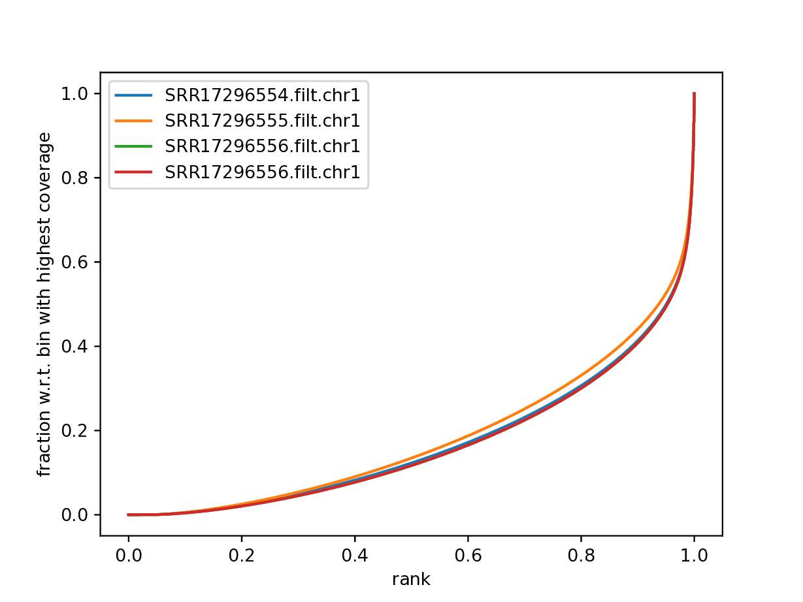

:::

::: {.callout-note collapse="true"}

### Fingerprint for ATAC-seq signal in Batf KO dataset. Non subset data.

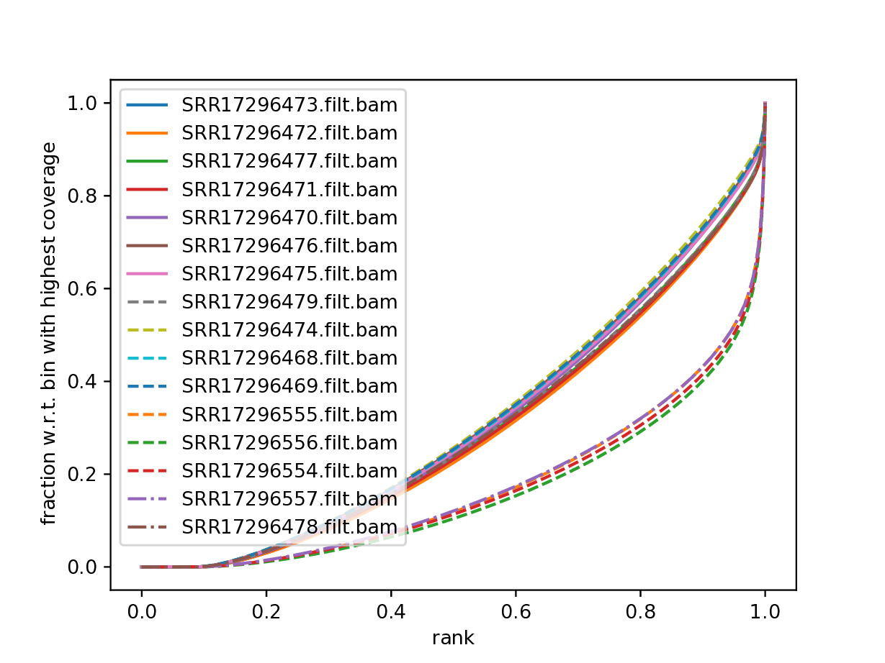

:::


<br />
<br />


### Replicate Clustering


**To assess overall similarity between libraries from different samples** one can compute sample clustering heatmaps using
[multiBamSummary](http://deeptools.readthedocs.io/en/latest/content/tools/multiBamSummary.html) and [plotCorrelation](http://deeptools.readthedocs.io/en/latest/content/tools/plotCorrelation.html) in bins mode from `deepTools`.

In this method the genome is divided into bins of specified size (`--binSize` parameter) and reads mapped to each bin are counted. The resulting signal profiles are used to cluster libraries to identify groups of similar signal profile.

In this part we use bam files prepared before the workshop, to save time.


```{bash}
#| eval: false
#| echo: true

mBS="apptainer exec --bind $(pwd) --bind ${topdir} --pwd $(pwd) ${contdir}/deeptools:3.5.6.img multiBamSummary"

$mBS bins --bamfiles SRR17296554.filt.chr1.bam SRR17296555.filt.chr1.bam SRR17296556.filt.chr1.bam SRR17296557.filt.chr1.bam \
   --smartLabels \
   --outFileName Invivo_proc.npz --binSize 5000 -p 5 &> multiBamSummary.log

pCor="apptainer exec --bind $(pwd) --bind ${topdir} --pwd $(pwd) ${contdir}/deeptools:3.5.6.img plotCorrelation"

$pCor --corData Invivo_proc.npz \
   --plotFile Invivo_proc_correlation_bin.pdf --outFileCorMatrix Invivo_proc_correlation_bin.txt \
   --whatToPlot heatmap --corMethod pearson --plotNumbers

# to change the correlation range plotted
$pCor --corData Invivo_proc.npz \
   --plotFile Invivo_proc_correlation_bin.pdf --outFileCorMatrix Invivo_proc_correlation_bin.txt \
   --whatToPlot heatmap --corMethod pearson --plotNumbers -min 0.95
```


You can copy the resulting file to your local system to view it.

What do you think?

- which samples are similar?

- are the clustering results as you would have expected them to be?


<br />
<br />


::: {.callout-note collapse="true"}

### Correlation of binned ATAC-seq signal in Batf KO *in vivo* data set. Data subset to chr 1.

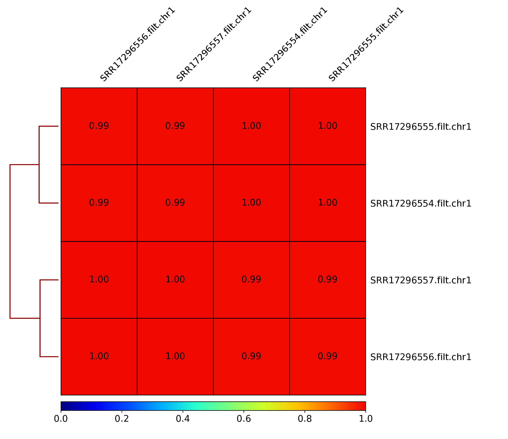

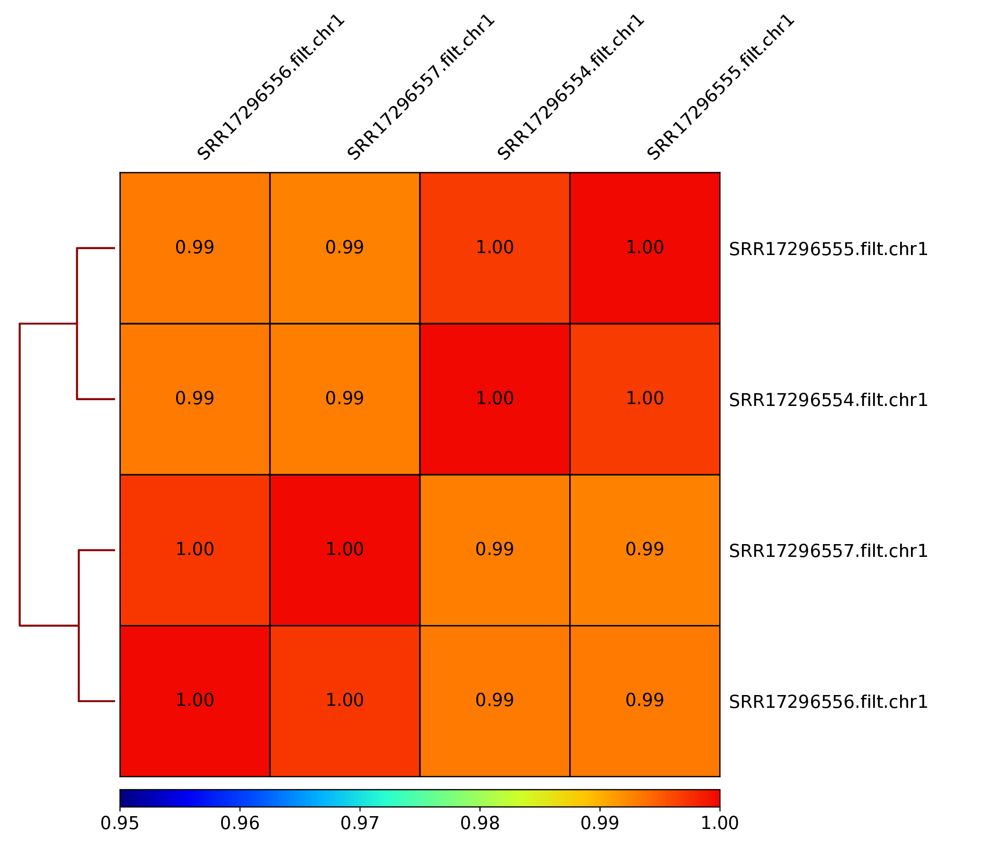)

:::

<br />
<br />


::: {.callout-note collapse="true"}

### Correlation of binned ATAC-seq signal in Batf KO *in vivo* and *in vitro* data sets. Non subset data.

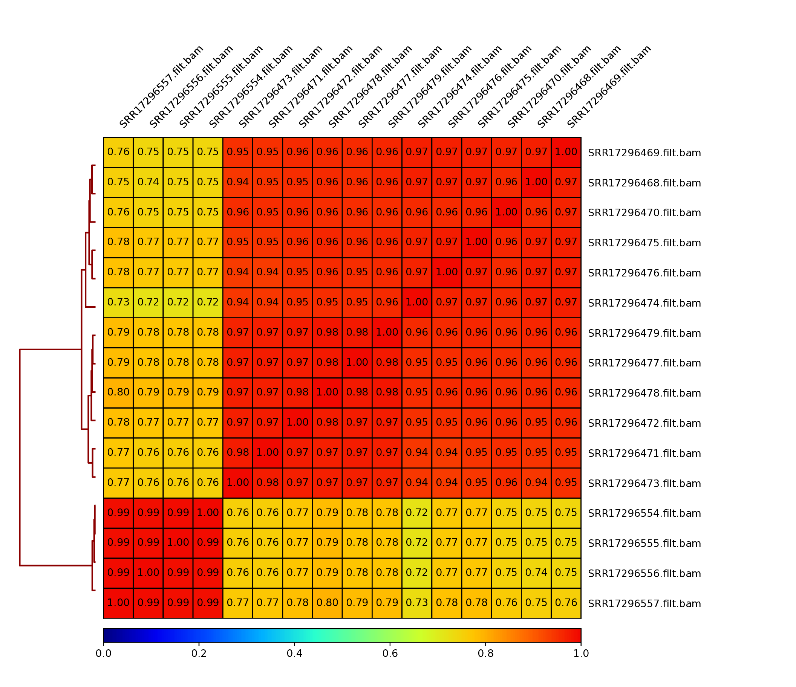

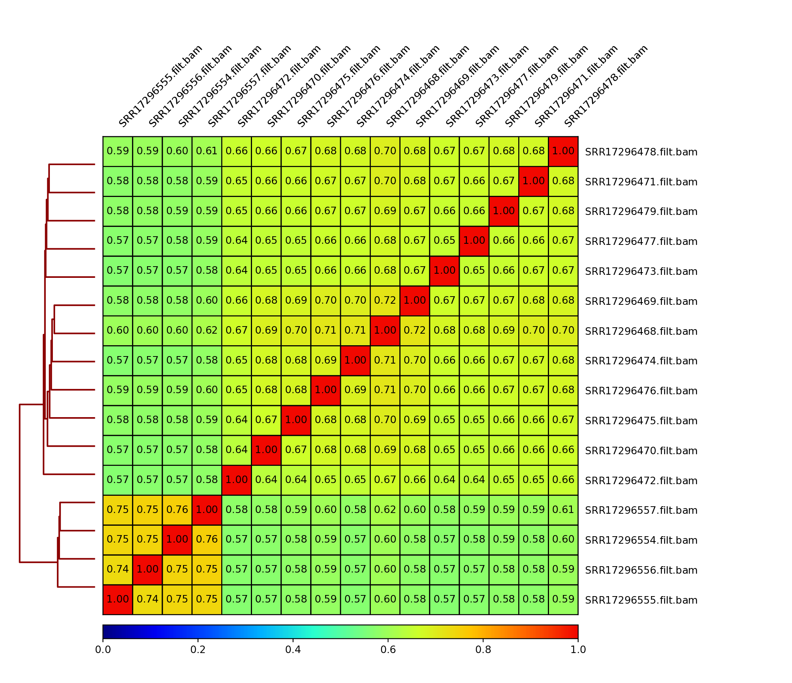

:::


<br />
<br />


In addition to these general procedures, several specialised assay - specific quality metrics exist, which probe signal characteristics related to each method. These are **key QC metrics** to evaluate the experiment and should always be colleced during the QC step.

We can now follow with the ATACseq specifc QC methods.

<br />
<br />
<br />
<br />

## Quality Control for ATAC-seq


<br />
<br />


The aim of this part of the data analysis workflow is to collect ATAC-seq specific quality metrics:


* fragment length distribution;

* presence of signal in nuclesome-free regions (NFR) and mononucleosome fractions;

* enrichment of signal in transcription start site (TSS) regions.


<br />
<br />

### Fragment Length Distribution


In ATAC-seq experiments, tagmentation of Tn5 transposases produces signature size pattern of fragments derived from nucleosome-free regions (NFR), mononucleosome, dinucleosome, trinucleosome and longer oligonucleosome from open chromatin regions (@fig-fraglen-assay, adapted from [@Li2019].

Please note the pre-processed BAM files need to be used to get an unbiased distribution of insert fragment size in the ATAC-seq library.


<br />
<br />

::: {#fig-fraglen-assay}

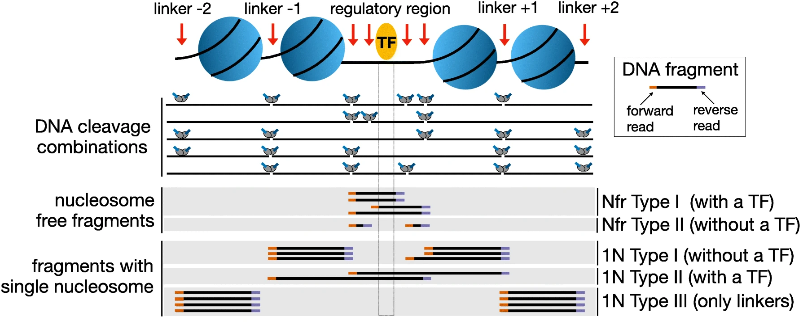

Library fragments in the ATAC-seq data.
:::

<br />

To compute fragment length distribution for processed bam file in our ATAC-seq data set (assuming we are in drectory `analysis`):

<br />

```{bash}
#| eval: false
#| echo: true

mkdir QC
cd QC

ln -s ../processedData/SRR17296554.blstMT_filt.dedup.bam  .
ln -s ../processedData/SRR17296554.blstMT_filt.dedup.bam.bai  .
  
module load picard/3.0.0-Java-17

java -Xmx31G -jar $EBROOTPICARD/picard.jar CollectInsertSizeMetrics \
  -I SRR17296554.blstMT_filt.dedup.bam \
  -O SRR17296554.chr1.proc.fraglen.stats \
  -H SRR17296554.chr1.proc.fraglen.pdf -M 0.5
```
<br />

You can copy the resulting file to your local system to view it.


Have a look at `SRR17296554.chr1.proc.fraglen.pdf` (@fig-fraglen-1), and answer

- does it indicate a good sample quality? is the chromatin structure preserved?

- what do the periodic peaks correspond to?


<br />


::: {#fig-fraglen-1}

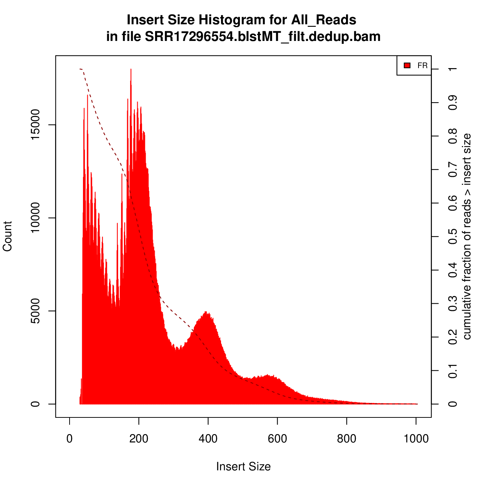{width=40%}

Fragment length histogram of ATAC-seq signal in sample SRR17296554.
:::

<br />
<br />


<br />
<br />


Generating this key QC plot is only possible for **PE libraries**. Can you tell what the peaks at approximately 50bp, 200bp, 400bp and 600bp correspond to?

<br />

To give some context compare to plots on @fig-fraglen-2. 

<br />

::: {#fig-fraglen-2 layout-ncol=2}

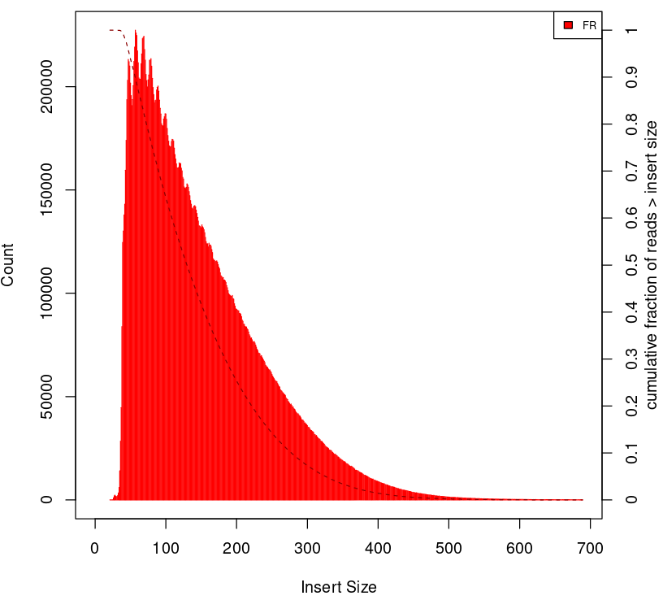{width=80%}

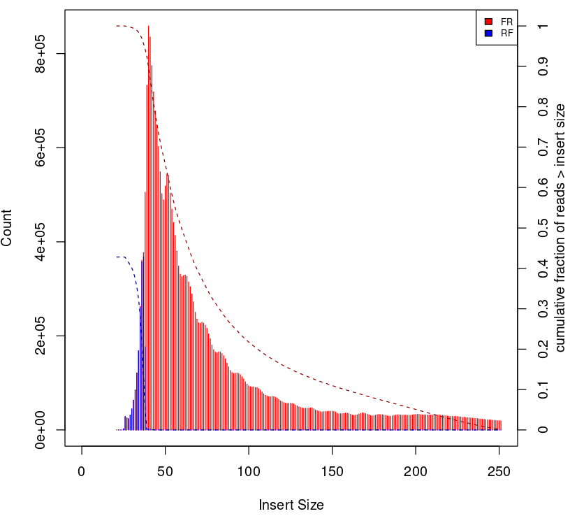{width=80%}

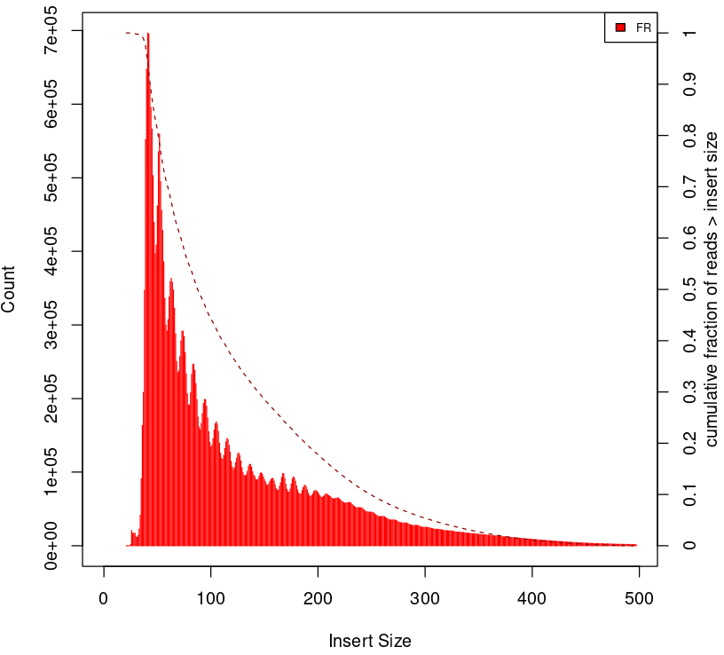{width=80%}

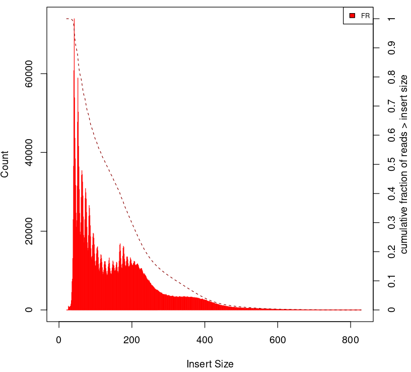{width=80%}

Examples of insert size distribution for ATAC-seq experiments.
:::

<br />
<br />

## Assessing Signal at Transcription Start Sites

<br />

### Data Preparation for Probing Signal at Transcription Start Sites (TSS)


We will be working in `R` in this section. First, we load the required version together with libraries:


<br />
<br />


```{bash}
#| eval: false
#| echo: true

module load R/4.6.1-gfbf-2026.1
module load R-bundle-CRAN/2026.07-foss-2026.1
module load R-bundle-Bioconductor/3.23-foss-2026.1-R-4.6.1

R
```
<br />

We can now update paths to library with R packages load necessary R libraries:

<br />

```{r}
#| eval: false
#| echo: true

.libPaths(c(.libPaths(),"/proj/epi2026/library/Rpackages/4.6.1"))


library(ATACseqQC)
library(BSgenome.Mmusculus.UCSC.mm39)
library(TxDb.Mmusculus.UCSC.mm39.knownGene)
library(ChIPpeakAnno)
library(Rsamtools)
```
<br />

We can read in the bam file:

<br />

```{r}
#| eval: false
#| echo: true

bamFile="SRR17296554.blstMT_filt.dedup.bam"
bamFileLabels="SRR17296554"
```

<br />

We collect library statistics:

```{r}
#| eval: false
#| echo: true

bam_qc=bamQC(bamFile, outPath = NULL)
```


We can now inspect the statistics:

```{r}
#| eval: false
#| echo: true

bam_qc[1:10]
```

The output:

```{r}
#| eval: false
#| echo: true

  bam_qc[1:10]

  $totalQNAMEs
  [1] 4720683

  $duplicateRate
  [1] 0.2942896

  $mitochondriaRate
  [1] 0

  $properPairRate
  [1] 1

  $unmappedRate
  [1] 0

  $hasUnmappedMateRate
  [1] 0

  $notPassingQualityControlsRate
  [1] 0

  $nonRedundantFraction
  [1] 0.5100756

  $PCRbottleneckCoefficient_1
  [1] 0.710388

  $PCRbottleneckCoefficient_2
  [1] 3.366668
```

<br />
<br />

Some of these values are meaningless at this point, as we have already processed the bam file (i.e. filtered fragments in problematic regions etc.) To compare the statistics for the non-subset file, please see below.

<br />

::: {.callout-note collapse="true"}

### Summary statistics for filtered non-subset SRR17296554.filt.bam data

  bam_qc_nonsub[1:10]:

```{r}
#| eval: false
#| echo: true

    $totalQNAMEs
    [1] 58847066

    $duplicateRate
    [1] 0.302227

    $mitochondriaRate
    [1] 0

    $properPairRate
    [1] 1

    $unmappedRate
    [1] 0

    $hasUnmappedMateRate
    [1] 0

    $notPassingQualityControlsRate
    [1] 0

    $nonRedundantFraction
    [1] 0.4967934

    $PCRbottleneckCoefficient_1
    [1] 0.699404

    $PCRbottleneckCoefficient_2
    [1] 3.18878
```
:::

<br />
<br />

### Shiftig and Splitting Aligned Reads

<br />

Tagmentation by Tn5 transposase produces 5’ overhang of 9 base long, the coordinates of reads mapping to the positive and negative strands need to be shifted by + 4 and - 5, respectively, to account for the 9-bp duplication created by DNA repair of the nick by Tn5 transposase and achieve base-pair resolution of TF footprint and motif-related analyses.

We perform it at this point to **plot signal at TSS**, and we save the resulting object for later use.

We create a directory where the processed bam files will be saved:


<br />

```{r}
#| eval: false
#| echo: true

## files will be saved into outPath respective to the working directory
outPath = "splitBam"
dir.create(outPath)
```

<br />

First, we collect information on which SAM/BAM tags are present in our bam file:

<br />

```{r}
#| eval: false
#| echo: true

possibleTag = combn(LETTERS, 2)
possibleTag = c(paste0(possibleTag[1, ], possibleTag[2, ]),
                   paste0(possibleTag[2, ], possibleTag[1, ]))
  
bamTop100 = scanBam(BamFile(bamFile, yieldSize = 100),
                       param = ScanBamParam(tag = possibleTag))[[1]]$tag
tags = names(bamTop100)[lengths(bamTop100)>0]
```

<br />

We **shift the coordinates** only for alignments on chr1, which is where most of our data is. We need to rename the chromosome id few times during this lab because of mismatch between annotation packages available via _Bioconductor_ and the reference genome used for read mapping. Please note that prepending / removing "chr" only works for assembled chromosomes, and is somewhat hacky, so for other genomes, use it at your own risk.

<br />

```{r}
#| eval: false
#| echo: true

seqlev="chr1"
which=as(seqinfo(Mmusculus)[seqlev], "GRanges")
  
#rename chr ids to match reference genome
seqlevels(which)=gsub("chr","",seqlevels(which))
```
<br />

We create an object with genomic alignments:

<br />

```{r}
#| eval: false
#| echo: true

gal=readBamFile(bamFile, tag=tags, which=which,asMates=TRUE, bigFile=TRUE)
```
<br />

This object is empty, because we used `bigFile=TRUE` - this is expected, so do not be alarmed.


The function `shiftGAlignmentsList` in the `ATACseqQC` package is used for shifting the alignments:

<br />

```{r}
#| eval: false
#| echo: true

shiftedBamFile=file.path(outPath, "shifted.bam")
gal1=shiftGAlignmentsList(gal, outbam=shiftedBamFile)
```
<br />
<br />

Next, we **split** the shifted alignments into different fractions **by length** (nucleosome free, mononucleosome, dinucleosome, and trinucleosome).

Shifted reads that do not fit into any of the above bins can be discarded. 

Splitting reads is a time-consuming step because we are using random forest to classify the fragments based on fragment length and GC content.

By default, we assign the top 10% of short reads (reads below 100_bp) as nucleosome-free regions and the top 10% of intermediate length reads as (reads between 180 and 247 bp) mononucleosome. This serves as the training set to classify the rest of the fragments.
 

We need genomic locations of TSS:

```{r}
#| eval: false
#| echo: true

txs=transcripts(TxDb.Mmusculus.UCSC.mm39.knownGene)
txs=txs[seqnames(txs) %in% "chr1"]
seqlevels(txs)=gsub("chr","",seqlevels(txs))
```

We need to rename chromosome ids in the `BSgenome` object:

<br />
<br />

```{r}
#| eval: false
#| echo: true

GenomeInfoDb::seqlevelsStyle(BSgenome.Mmusculus.UCSC.mm39)="NCBI"
seqinfo(BSgenome.Mmusculus.UCSC.mm39)

genome=Mmusculus
```


We split the alignments (this process takes a few minutes):

```{r}
#| eval: false
#| echo: true

objs=splitGAlignmentsByCut(gal1, txs=txs, genome=genome, outPath = outPath)

saveRDS(objs, file="atacsqQC.objs.rds")
```


Finally, we have prepared the data for **plotting the signal in NFR and mononuclesome fraction** and calculating **signal distribution at TSS**.


<br />
<br />


### Signal in NFR and Mononucleosome Fractions

Files we are going to use and TSS coordinates:

<br />

```{r}
#| eval: false
#| echo: true

bamFiles=file.path(outPath,
                       c("NucleosomeFree.bam",
                       "mononucleosome.bam",
                       "dinucleosome.bam",
                       "trinucleosome.bam"))

TSS=promoters(txs, upstream=0, downstream=1)
TSS=unique(TSS)
```
<br />

Calculate and log2 transform the signal around TSS:

<br />

```{r}
#| eval: false
#| echo: true

librarySize=estLibSize(bamFiles)

seqlev="1" #we only consider one chromosome
  
NTILE=101
dws=1010
ups=1010

sigs=enrichedFragments(gal=objs[c("NucleosomeFree",
                                       "mononucleosome",
                                       "dinucleosome",
                                       "trinucleosome")],
                            TSS=TSS,
                            librarySize=librarySize,
                            seqlev=seqlev,
                            TSS.filter=0.5,
                            n.tile = NTILE,
                            upstream = ups,
                            downstream = dws)

saveRDS(sigs, file="atacsqQC.sigs.rds")

sigs.log2=lapply(sigs, function(.ele) log2(.ele+1))
```
<br />

We can now save the signal heatmap:

<br />

```{r}
#| eval: false
#| echo: true

pdf("Heatmap_splitbam.pdf")
  featureAlignedHeatmap(sigs.log2, reCenterPeaks(TSS, width=ups+dws),
                        zeroAt=.5, n.tile=NTILE)

dev.off()

```

<br />

* What are the differences in the signal profile in these two fractions? Why do we observe them?


<br />

::: {.callout-note collapse="true"}

### Heatmap of ATAC-seq signal in NFR and mononculeosome fractions

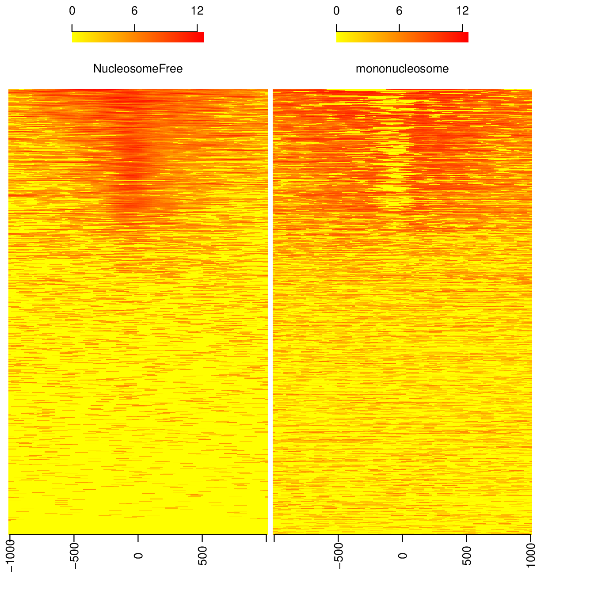{width=70%}

:::

<br />
<br />

We can now calculate signal density at TSS:

<br />

```{r}
#| eval: false
#| echo: true

out=featureAlignedDistribution(sigs, 
                                    reCenterPeaks(TSS, width=ups+dws),
                                    zeroAt=.5, n.tile=NTILE, type="l", 
                                    ylab="Averaged coverage")

## rescale the nucleosome-free and nucleosome signals to 0~1 for plotting
range01=function(x){(x-min(x))/(max(x)-min(x))}
out=apply(out, 2, range01)

```

And plot it:


```{r}
#| eval: false
#| echo: true

pdf("TSSprofile_splitbam.pdf")
    matplot(out, type="l", xaxt="n",
          xlab="Position (bp)",
          ylab="Fraction of signal")
    axis(1, at=seq(0, 100, by=10)+1,
       labels=c("-1K", seq(-800, 800, by=200), "1K"), las=2)
    abline(v=seq(0, 100, by=10)+1, lty=2, col="gray")
dev.off()

```

<br />

* What are the differences in the signal profile in these two fractions? Why do we observe them?


<br />

::: {.callout-note collapse="true"}

### Profiles of ATAC-seq signal in NFR and mononculeosome fractions

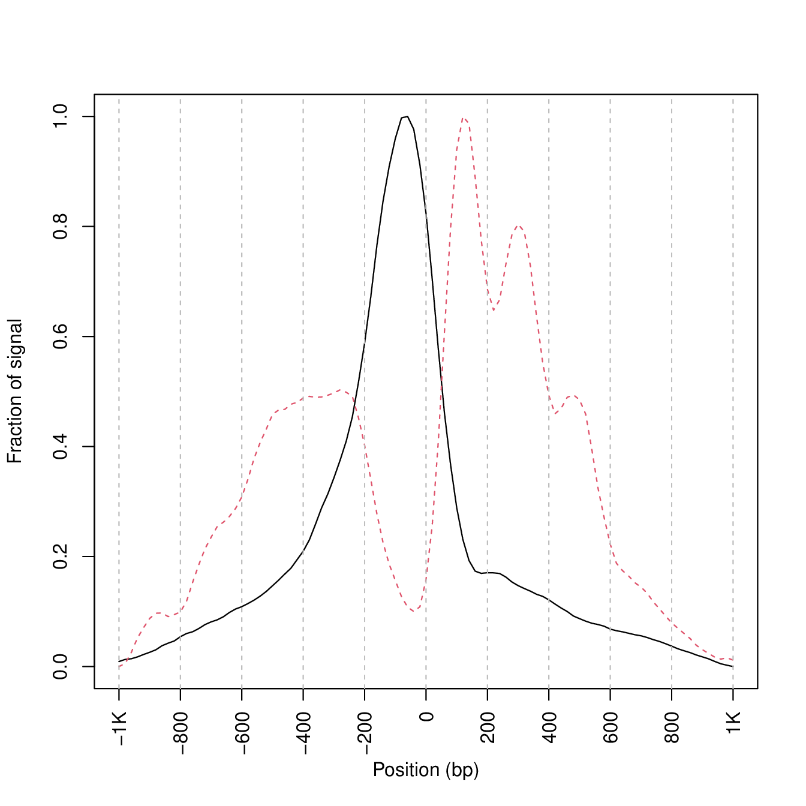{width=70%}

:::

<br />

::: {.callout-note}

To finish working in `R` type `q()`. Do not save workspace image - in this case, to save space.

:::


<br />
<br />


## Signal Visualisation Using IGV


In this part we will look more closely at our data, which is a good practice, as data summaries can be at times misleading. In principle we could look at the data on Uppmax using installed tools but it is much easier (and glitch-free) to work with genome browser locally. 
If you have not done this before the course, install Interactive Genome Browser [IGV](https://www.broadinstitute.org/igv/).

We would like to visualise processed alignments (bam and corresponding bai) at several loci with strong signal. We can also view the bam files split into nucleosome-free, mono- di- and tri- nucleosome fractions.

<br />


We will need the following files:

* `atacseq/analysis/processedData/SRR17296554.blstMT_filt.dedup.bam` and `bai`

* `atacseq/analysis/QC/splitBam/NucleosomeFree.bam` and `bai`

* `atacseq/analysis/QC/splitBam/mononucleosome.bam` and `bai`

* `atacseq/analysis/QC/splitBam/dinucleosome.bam` and `bai`

* `atacseq/analysis/QC/splitBam/trinucleosome.bam` and `bai`

<br />
<br />

::: {.callout-note collapse="true"}

### Copying files from remote server

To copy files from Pelle (or any remote host) you need to know the path to the file on Pelle  (i.e. the remote side). Type in the terminal::

```{bash}
#| eval: false
#| echo: true

pwd
```

This gives you the path to the working directory, e.g::

```{bash}
#| eval: false
#| echo: true

/proj/epi2026/private/agata/atac_tst/atacseq/analysis/deepTools
```

To copy file `Invivo_proc.fingerprint.pdf` to *current directory*, type in the **local** terminal:

```{bash}
#| eval: false
#| echo: true

scp <username>@pelle.uppmax.uu.se:/path/to/file .
```

E.g.:

```{bash}
#| eval: false
#| echo: true

scp agata@pelle.uppmax.uu.se:/proj/epi2026/private/agata/atac_tst/atacseq/analysis/deepTools/Invivo_proc.fingerprint.pdf .
```

You will be prompted to input the 2FA code following the password to Uppmax.
:::

<br />
<br />

::: {.callout-important icon=false}
  
  The reads are mapped to genome assembly **GRCm39**  / **mm39** which may need to be downloaded in your IGV version. To download a new genome, in IGV: Genomes > Hosted Genomes, then search for mm39.

:::


<br />

You will have to zoom in to view the alignments and coverage tracks.

Change the default viewing settings in IGV by `shift-clicking` (or `right-clicking` on some OS) onto a track name (left panel):

**bam** tracks:

* alignment view to `Squished`

* colour alignments to `insert size and pair orientation`

**coverage** tracks:

* pay attention to track scale (signal range); it is set to `Auto`; the tracks are not displayed at the same range, you can harmonise the scale if you want to see the differences in signal range


<br />

You can move along the chromosome 1 and you will spot locations with high signal density.

Examples:

* `chr1:10,009,356-10,018,135`

* `chr1:10,105,613-10,114,392`

* `chr1:161,497,776-161,499,970`

* `chr1:155,074,991-155,079,380`

* `chr1:95,191,577-95,200,356`

<br />


::: {#fig-tracks1}

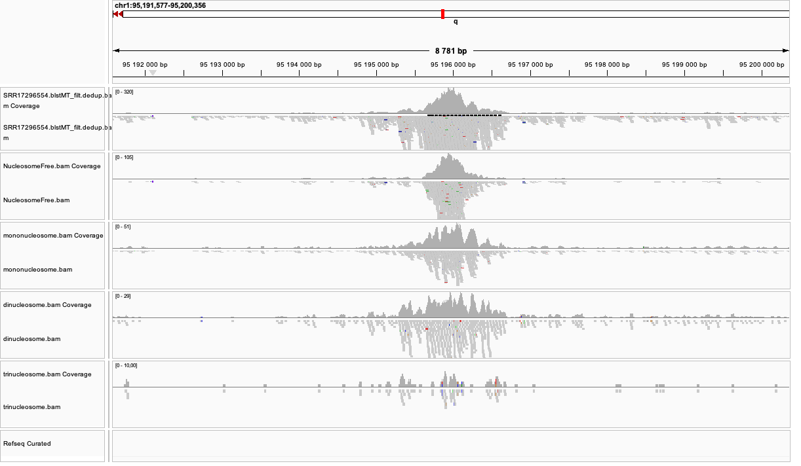{width=80%}

Signal in bam files split into fractions by fragment length.
:::

<br />

Another example is shown on @fig-tracks2 (obtained using a different data set). This figure includes also detected peak intervals - we will discuss them in detail in the following sections).

<br />

::: {#fig-tracks2}

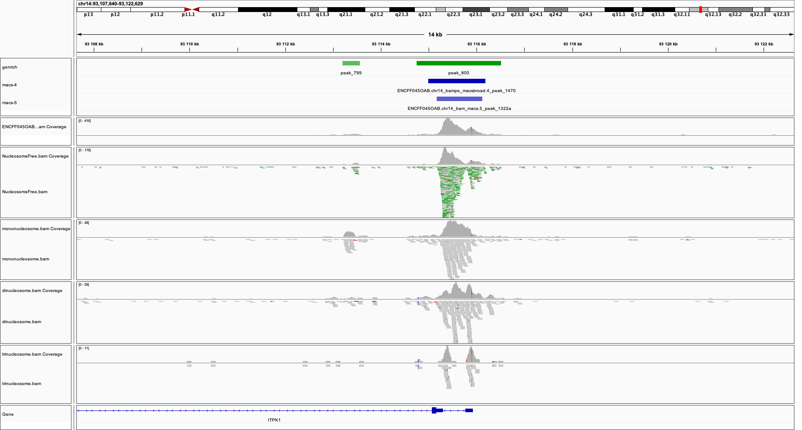{width=80%}

Signal in bam files split into fractions by fragment length.
:::

<br />


*Bonus question*

* Why does the NFR track show unusually high fraction of discordant alignments (labeled green)?

<br />
<br />


After the processing and QC performed in this tutorial, we can now move to [ATAC-seq data analysis](../ATACpeaks/index.html). 

