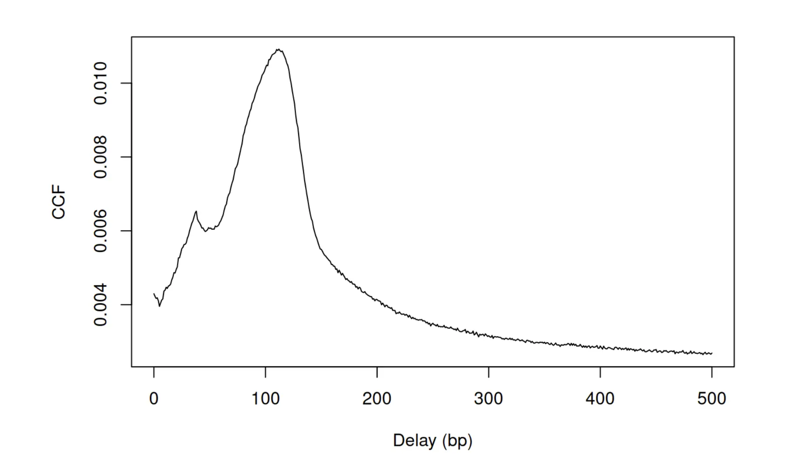

## Overview


```{r}
.libPaths(c("/Users/daniamachlab/Library/R/arm64/4.6-Bioc-3.23/library/", .libPaths()))

suppressPackageStartupMessages({
  library(QuasR)
  library(limma)
  library(BSgenome.Mmusculus.UCSC.mm39)
  library(GenomicRanges)
  library(csaw)
  library(ggplot2)
  library(tidyr)
  #library(GenomeInfoDb)
})

```


## Useful Bioconductor data structures

Throughout this lab we will be making use of a few data objects and packages from Bioconductor that are convenient when working with genomic data. They are described here and additional links are provided should you want to explore more or get a better understanding.

### GRanges

### BSgenome objects

### DNAstringSet

## Mapping


Download bam files from Pelle.

```{bash}
#| eval: false

rsync [username]@pelle.uppmax.uu.se:[path_to_file]

## Download the bam files
mkdir data
rsync danmac@pelle.uppmax.uu.se:'/proj/uppmax2026-1-197/ChIP/dataMapped/*_chr19.ucsc.fixed.bam*' data/ 
  
## Download the reference genome used
#mkdir reference
#rsync danmac@pelle.uppmax.uu.se:/proj/uppmax2026-1-197/ChIP/reference/Mus_musculus.GRCm39.dna.primary_assembly.fa reference/ 
```


## Quality Control (QC)

Let's begin by doing some QC on the mapped reads. We will be using the [QuasR](https://bioconductor.org/packages/QuasR) package to do this. 

```{r}
## Create the sample sheet needed by QuasR
## ... See ?qAlign for more details
bamFiles <- file.path(getwd(), 
                      list.files("data", pattern = ".bam$", full.names = TRUE))
meta <- data.frame(FileName = bamFiles, 
                   SampleName = limma::strsplit2(basename(bamFiles), "_chr19")[, 1])
write.table(meta, file = "data/sampleSheet.txt", quote = FALSE, sep = "\t", 
            row.names = FALSE, append = FALSE)

## Create proj object on aligned bam files
## ... you can set the number of cores here according to what works on you machine
cl <- makeCluster(4)
proj <- qAlign(sampleFile = "data/sampleSheet.txt", 
               genome = "BSgenome.Mmusculus.UCSC.mm39", 
               paired = "no", 
               clObj = cl, 
               checkOnly = TRUE)

## QC plots
dir.create("figures")
qQCReport(input = proj,  pdfFilename = "figures/mappingQC.pdf", clObj=cl)
```

Examine the generated `pdf` file and the plots it contains. We like to see high mapping rates typically close to 95% and no big differences in duplicate levels between the samples. Note that here you will see 100% since the bam files have already been filtered for only reads mapping to chr19.

### GC Bias

An important plot we often look at in ChIP-seq data is the GC-bias trends the samples have. Do they have very different ones and what are the consequences of that?

```{r}
## BSgenome
BSgenome <- BSgenome.Mmusculus.UCSC.mm39

## Tile the genome (on chr19 in our case) into 100 bp regions
tiles <- tileGenome(seqlengths = seqlengths(BSgenome)["chr19"], 
                    tilewidth = 500, 
                    cut.last.tile.in.chrom = TRUE)
tiles
```

Next, we will make use of the BSgenome object to extract the reference genome sequences and calculate the GC content of each tile.

```{r}

## Extract the raw reference sequences
tileSeq <- getSeq(BSgenome, tiles)

## Calculate G+C and CpG obs/expected
fMono <- oligonucleotideFrequency(tileSeq, width = 1L, as.prob = TRUE)
fDi <- oligonucleotideFrequency(tileSeq, width = 2L, as.prob = TRUE)
fracGC <- fMono[, "G"] + fMono[, "C"]
oeCpG <- (fDi[, "CG"] + 0.01) / (fMono[, "G"] * fMono[, "C"] + 0.01)

## Add the information to the tiles object
tiles$fracGC <- fracGC
tiles$oeCpG <- oeCpG

## Mark tiles with overlap with CpG islands
## ... if you cloned the repo, you can read it in from the assets folder. Otherwise
## ... you will need to download it from here: 
## ... http://hgdownload.cse.ucsc.edu/goldenPath/mm39/database/cpgIslandExt.txt.gz
## ... UCSC bed files are 0-base coordinates so we will have to add +1 to the start position.
cpgFile <- "assets/cpgIslandExt.txt"
cpg <- read.delim(cpgFile, header = FALSE)
cpgGr <- GRanges(
    seqnames = cpg[[2]],
    ranges = IRanges(
        start = cpg[[3]] + 1,
        end = cpg[[4]]
    )
)

ov <- findOverlaps(query = tiles, subject = cpgGr, minoverlap = 5)
cpgTiles <- unique(queryHits(ov))
tiles$overlappingCpG <- ifelse(test = 1:length(tiles) %in% cpgTiles, 
                               yes = TRUE, no = FALSE)

head(tiles)
```


::: {.callout-tip}
## Exercise
Examine the different objects above and get more familiar with what they show. You can use the help pages of the used functions with `?functionName` ro inspect that the functions does, expects and gives back.
:::

We can now proceed to counting the reads on the tiles we have produced. This will take a few seconds.
```{r}
## Quantify reads
cntTiles <- qCount(proj = proj, query = tiles, mapqMin = 42, clObj = cl)
head(cntTiles)
```

Let's plot the log2(counts) vs the GC content of the tiles.

```{r}
#| fig-width: 15
#| fig-height: 10

## Prepare to plot
## ... We randomly subsample 25,000 tiles for faster plotting and
## ... exclude tiles which have zero counts in all samples
df <- as.data.frame(cbind(cntTiles, mcols(tiles))) 
zeroCounts <- rowSums(cntTiles[, -1]) == 0
sum(zeroCounts) / nrow(df)
df <- df[!zeroCounts, ]

set.seed(123)
i <- sample(x = 1:nrow(df), size = 25000, replace = FALSE)
df <- df[i, ]

df <- df %>%
  as_tibble() %>%
  pivot_longer(cols = starts_with("ChIPseq_"), names_to = "sample", values_to = "rawCount")


## Plot
ggplot(df, aes(x = fracGC, y = log2(rawCount+1))) +
  geom_point(size = 0.3) + 
  theme_bw() + 
  facet_wrap(~sample)
```

Compare the input samples to those where the TF was pulled down. What do you notice? 

In this data set we notice a few things. Firstly, there is not relationship between count and GC content. It looks to be flat, and secondly that the samples have the same relationship between read count and GC content. If we had considerable differences in GC trends between samples we wish to quantitatively compare we would have had to normalize them accordingly before comparing them or doing differential analyses, as the differences in counts could be purely driven by differences in GC trends. We will explore how to correct for this in the advanced ChIP-seq tutorial. 

Notice that the cloud above the background represents tiles with signal, where the TF is bound. Another thing to look out for is how similar the signal or enrichment is for these samples. Was there one replicate which had a very poor signal for instance?


::: {.callout-tip}
## Exercise
Re-do the plots above, coloring by `oeCpG` and `overlappingCpG`. Depending on the mark, the signal can sometimes overlap with CpG islands. Do you see this here?
:::


## Estimating fragment size

ChIP-seq enriches the DNA fragments containing the bound TF, and so the reads start at the beginning of the fragment. This does not reflect where the TF was sitting, likely somewhere in the middle of the fragment. To have the reads reflect the position of the TF, which is our signal of interest, the reads need to be shifted by a size which approximately translates to half the fragment size. Figure  @fig-readShift from @Wilbanks2010 illustrates this. Our samples contains single end (SE) reads, some coming from the negative and some the positive strand. We can use this to estimate the original fragment size by shifting the reads from the forward strand and calculating the cross-correlation between the shifted forward positions and the original reverse positions.

::: {layout-ncol=2}

{#fig-readShift height=300px}

{#fig-crossCorr height=300px}

:::


Let's take one example sample and estimate the average fragment size. Note that this needs to be a non-input sample.
```{r}
## Prepare to read the bam file into R
bamFile <- "data/ChIPseq_ESC_CTCF_IP_wt_rep1_chr19.ucsc.fixed.bam"
param <- readParam(minq=20)

max.delay <- 500
dedup.on <- initialize(param, dedup=TRUE)
x <- correlateReads(bamFile, max.delay, param=param)
plot(0:max.delay, x, type="l", ylab="CCF", xlab="Delay (bp)")
maximizeCcf(x)
```


::: {.callout-tip}
## Exercise
Choose another sample and estimate the average fragment size. How does it compare to `ChIPseq_ESC_CTCF_IP_wt_rep1`? By how much should the reads be shifted on average to get the TF binding location?
:::


## peak calling per sampel and comparing across replicates

have backups ready here..(pelle down)

## common set of peaks, and quantify


scatter plots, PCA, qProfile, diff binding?


### Global correlation

Let's use the counts on the tiles and look at how the samples correlate with each other on a global level. Ideally, we want to see replicates of the same condition grouping together, unless there are other reasons they shouldn't. For example if the signals differ a lot between samples and that drives the correlation, if the biological source of variation between conditions is smaller than the technical source of variation, or if there are no biological differences between conditions.

First, we need to normalize for difference in library size between samples.
```{r}

# cpm <- sweep(x = cnt_tiles[, -1], MARGIN = 2, STATS = colSums(cnt_tiles[, -1]), FUN = "/")*1e6
# log_cpm <- as.data.frame(log2(cpm + 1))
# 


```


## Extra: histone mark: do same thing
 
TF vs histone mark
 


