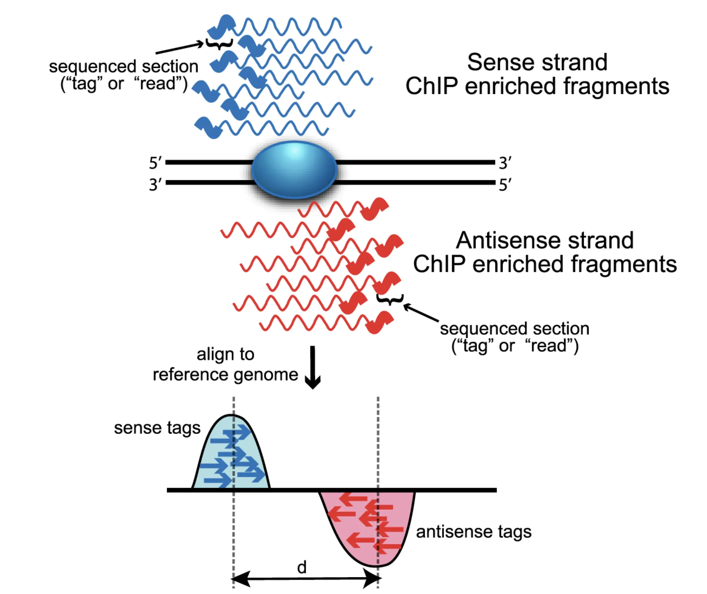

## Overview


```{r}
.libPaths(c("/Users/daniamachlab/Library/R/arm64/4.6-Bioc-3.23/library/", .libPaths()))

suppressPackageStartupMessages({
  library(QuasR)
  library(limma)
  library(BSgenome.Mmusculus.UCSC.mm39)
  library(GenomicRanges)
  library(rtracklayer)
  library(csaw)
  library(Rsamtools)
  library(ggplot2)
  library(patchwork)
  library(ComplexHeatmap)
  library(circlize)
  library(tidyr)
  library(tibble)
  library(dplyr)
  library(SimpleUpset)
  library(extraChIPs)
  #library(stringr)
  #library(GenomeInfoDb)
})

```


## Useful Bioconductor data structures

Throughout this lab we will be making use of a few data objects and packages from Bioconductor that are convenient when working with genomic data. They are described here and additional links are provided should you want to explore more or get a better understanding.

### GRanges

### BSgenome objects

### DNAstringSet

### SummarizedExperiment

## Mapping


Download bam files from Pelle.

```{bash}
#| eval: false

rsync [username]@pelle.uppmax.uu.se:[path_to_file]

## Download the bam files
mkdir data
rsync danmac@pelle.uppmax.uu.se:'/proj/uppmax2026-1-197/ChIP/dataMapped/*_chr19.ucsc.fixed.bam*' data/ 
  
## Download the reference genome used
#mkdir reference
#rsync danmac@pelle.uppmax.uu.se:/proj/uppmax2026-1-197/ChIP/reference/Mus_musculus.GRCm39.dna.primary_assembly.fa reference/ 
```


## Quality Control (QC)

Let's begin by doing some QC on the mapped reads. We will be using the [QuasR](https://bioconductor.org/packages/QuasR) package to do this. 

```{r}
## Create the sample sheet needed by QuasR
## ... See ?qAlign for more details
bamFiles <- file.path(getwd(), 
                      list.files("data", pattern = ".bam$", full.names = TRUE))
meta <- data.frame(FileName = bamFiles, 
                   SampleName = limma::strsplit2(basename(bamFiles), "_chr19")[, 1])
write.table(meta, file = "data/sampleSheet.txt", quote = FALSE, sep = "\t", 
            row.names = FALSE, append = FALSE)

## Create proj object on aligned bam files
## ... you can set the number of cores here according to what works on you machine
cl <- makeCluster(4)
proj <- qAlign(sampleFile = "data/sampleSheet.txt", 
               genome = "BSgenome.Mmusculus.UCSC.mm39", 
               paired = "no", 
               clObj = cl, 
               checkOnly = TRUE)

## QC plots
dir.create("figures")
qQCReport(input = proj,  pdfFilename = "figures/mappingQC.pdf", clObj=cl)
```

Examine the generated `pdf` file and the plots it contains. We like to see high mapping rates typically close to 95% and no big differences in duplicate levels between the samples. Note that here you will see 100% since the `bam` files have already been filtered for only reads mapping to chr19.

Let's examine the distribution of hte mapping quality scores of the reads in sample `ChIPseq_ESC_CTCF_IP_wt_rep1`.
```{r}
## get the mapping quality scores of the reads
bamFile <- "data/ChIPseq_ESC_CTCF_IP_wt_rep1_chr19.ucsc.fixed.bam"
scannedBam <- scanBam(bamFile, 
                      param = ScanBamParam(what = c("qname", "mapq")))


## prepare to plot
df <- data.frame(readName = scannedBam[[1]]$qname, 
                 mappingScore = scannedBam[[1]]$mapq)

## plot the mapping scores distribution
ggplot(df) + 
  geom_histogram(aes(x = mappingScore), bins = 50) + 
  theme_bw()
```

We observe that for this aligner, a mapping score of 42 (which is the maximum here) reflects uniquely aligned reads. We also see that most reads have high mapping scores which is informative for when we want to set cutoffs for minimum mapping quality as we continue with our analyses. Setting a minimum mapping score of 30 when counting for example, we won't lose that many reads. We can also focus on uniquely mapping reads by setting that minimum to 42.

### GC Bias

An important plot we often look at in ChIP-seq data is the GC-bias trends the samples have. Do they have very different ones and what are the consequences of that?

```{r}
## BSgenome
BSgenome <- BSgenome.Mmusculus.UCSC.mm39

## Tile the genome (on chr19 in our case) into 100 bp regions
tiles <- tileGenome(seqlengths = seqlengths(BSgenome)["chr19"], 
                    tilewidth = 500, 
                    cut.last.tile.in.chrom = TRUE)
tiles
```

Next, we will make use of the BSgenome object to extract the reference genome sequences and calculate the GC content of each tile.

```{r}

## Extract the raw reference sequences
tileSeq <- getSeq(BSgenome, tiles)

## Calculate G+C and CpG obs/expected
fMono <- oligonucleotideFrequency(tileSeq, width = 1L, as.prob = TRUE)
fDi <- oligonucleotideFrequency(tileSeq, width = 2L, as.prob = TRUE)
fracGC <- fMono[, "G"] + fMono[, "C"]
oeCpG <- (fDi[, "CG"] + 0.01) / (fMono[, "G"] * fMono[, "C"] + 0.01)

## Add the information to the tiles object
tiles$fracGC <- fracGC
tiles$oeCpG <- oeCpG

## Mark tiles with overlap with CpG islands
## ... if you cloned the repo, you can read it in from the assets folder. Otherwise
## ... you will need to download it from here: 
## ... http://hgdownload.cse.ucsc.edu/goldenPath/mm39/database/cpgIslandExt.txt.gz
## ... UCSC bed files are 0-base coordinates so we will have to add +1 to the start position.
cpgFile <- "assets/cpgIslandExt.txt"
cpg <- read.delim(cpgFile, header = FALSE)
cpgGr <- GRanges(
    seqnames = cpg[[2]],
    ranges = IRanges(
        start = cpg[[3]] + 1,
        end = cpg[[4]]
    )
)

ov <- findOverlaps(query = tiles, subject = cpgGr, minoverlap = 5)
cpgTiles <- unique(queryHits(ov))
tiles$overlappingCpG <- ifelse(test = 1:length(tiles) %in% cpgTiles, 
                               yes = TRUE, no = FALSE)

head(tiles)
```


::: {.callout-tip}
## Exercise
Examine the different objects above and get more familiar with what they show. You can use the help pages of the used functions with `?functionName` ro inspect that the functions does, expects and gives back.
:::

We can now proceed to counting the reads on the tiles we have produced. This will take a few seconds.
```{r}
## Quantify reads
cntTiles <- qCount(proj = proj, query = tiles, mapqMin = 42, clObj = cl)
head(cntTiles)
```

Let's plot the log2(counts) vs the GC content of the tiles.

```{r}
#| fig-width: 15
#| fig-height: 10

## Prepare to plot
## ... We randomly subsample 25,000 tiles for faster plotting and
## ... exclude tiles which have zero counts in all samples
df <- as.data.frame(cbind(cntTiles, mcols(tiles))) 
zeroCounts <- rowSums(cntTiles[, -1]) == 0
sum(zeroCounts) / nrow(df)
df <- df[!zeroCounts, ]

set.seed(123)
i <- sample(x = 1:nrow(df), size = 25000, replace = FALSE)
df <- df[i, ]

df <- df %>%
  as_tibble() %>%
  pivot_longer(cols = starts_with("ChIPseq_"), names_to = "sample", values_to = "rawCount")


## Plot
ggplot(df, aes(x = fracGC, y = log2(rawCount+1))) +
  geom_point(size = 0.3) + 
  theme_bw() + 
  facet_wrap(~sample)
```

Compare the input samples to those where the TF was pulled down. What do you notice? 

In this data set we notice a few things. Firstly, there is not relationship between count and GC content. It looks to be flat, and secondly that the samples have the same relationship between read count and GC content. If we had considerable differences in GC trends between samples we wish to quantitatively compare we would have had to normalize them accordingly before comparing them or doing differential analyses, as the differences in counts could be purely driven by differences in GC trends. We will explore how to correct for this in the advanced ChIP-seq tutorial. 

Notice that the cloud above the background represents tiles with signal, where the TF is bound. Another thing to look out for is how similar the signal or enrichment is for these samples. Was there one replicate which had a very poor signal for instance?


::: {.callout-tip}
## Exercise
Re-do the plots above, coloring by `oeCpG` and `overlappingCpG`. Depending on the mark, the signal can sometimes overlap with CpG islands. Do you see this here?
:::

### Global correlation

Another quick QC step already at the tile level, is to look at how the samples group together. Ideally, we want to see replicates of the same condition grouping together, unless there are other reasons they shouldn't. For example if the signals differ a lot between samples and that drives the correlation, if the biological source of variation between conditions is smaller than the technical source of variation, or if there are no biological differences between conditions.

First, we need to normalize for difference in library size between samples. Let's do this by calculating count per million. Briefly, for each sample, each tile's count is divided by the total numebr of reads in that sample and then multiplied by 1 million to get reads per million.
```{r}
#| fig-width: 10
#| fig-height: 8

## log2(CPM+1)
cpm <- sweep(x = cntTiles[, -1], MARGIN = 2, STATS = colSums(cntTiles[, -1]), FUN = "/")*1e6
log2cpm <- log2(cpm + 1)

## Shorten the sample names
colnames(log2cpm) <- gsub("ChIPseq_ESC_CTCF_", "", colnames(log2cpm))

## Pearson correlation
cor <- cor(log2cpm)

## Plot correlation heatmap
Heatmap(cor, name = "Pears Corr")
```

We can notice a separation between input and IP samples. Within the IP samples we don't see obvious groupings based on condition (wt or BPTFko). This may be due to most tiles being background noise and this dominating the correlation. We will see later if this improves when looking at the peak count matrix.


### Enrichment over the input sample


Let's next use the tile count matrix to calculate enrichment values for the ChIP-seq samples. We will first calculate normalized counts, correcting for library size differences between samples.
```{r}
## Normalized count matrix
cnt <- cntTiles[, -1]
medianLib <- median(colSums(cnt))
cntNorm <- sweep(cnt, MARGIN = 2, STATS = colSums(cnt), FUN = "/") * medianLib
log2cntNorm <- log2(cntNorm + 8)
```

::: {.callout-tip}
## Exercise
Compare the library sizes before and after correction. You can use `colSums` to sum the reads per sample.
:::

Let's calculate the enrichment values over the input for all samples. The enrichment will be calculated as $enr=log_2\frac{(normCountIP+8)}{(normCountInput+8)}$.

```{r}
## Samples
samples <- apply(limma::strsplit2(colnames(cnt), "_")[, 5:6], 
                 MARGIN = 1, 
                 FUN = function(x){paste(x, collapse = "_")})
spl <- split(colnames(cnt), samples)
spl
```


```{r}
## Calculate enrichment of input for all IP samples
enr <- do.call(cbind, lapply(spl, function(samples){
  ip <- samples[grep("_IP_", samples)]
  input <- samples[grep("_input_", samples)]
  log2cntNorm[, ip] - log2cntNorm[, input]
}))
head(enr)
```

We can now look at the distribution of these enrichment values. Let's have a look at sample `wt_rep1`.
```{r}
## Prepare to plot
df <- as.data.frame(enr) %>% 
  pivot_longer(cols = everything(), names_to = "sample", values_to = "enr") %>%
  dplyr::filter(sample == "wt_rep1")

## Plot
ggplot(df) + 
  geom_histogram(aes(x = enr), bins = 60) + 
  theme_bw()
```

The normal looking distribution shows the background, and we can set a cutoff at around 2 to select for tiles which we consider enriched for the TF. Let's do that and see where these tiles fall in the count vs GC plot.

```{r}
#| fig-width: 10
#| fig-height: 4

## Label enriched tiles for wt_rep1
enrTiles <- enr[, "wt_rep1"] > 2

## Prepare to plot
df <- as.data.frame(cbind(cntTiles, mcols(tiles))) 
df$enrTiles <- enrTiles
df$enr <- enr[, "wt_rep1"] 
zeroCounts <- rowSums(cntTiles[, -1]) == 0
sum(zeroCounts) / nrow(df)
df <- df[!zeroCounts, ]

set.seed(123)
i <- sample(x = 1:nrow(df), size = 25000, replace = FALSE)
df <- df[i, ]

df <- df %>%
  as_tibble() %>%
  pivot_longer(cols = starts_with("ChIPseq_"), names_to = "sample", values_to = "rawCount") %>% 
  dplyr::filter(sample == "ChIPseq_ESC_CTCF_IP_wt_rep1")

## Plot
p1 <- ggplot(df, aes(x = fracGC, y = log2(rawCount+1))) +
  geom_point(aes(color = enr), size = 0.3) + 
  scale_color_viridis_c() + 
  theme_bw()
p2 <- ggplot(df, aes(x = fracGC, y = log2(rawCount+1))) +
  geom_point(aes(color = enrTiles), size = 0.3) + 
  theme_bw()
p1 + p2
```


## Estimating the fragment size

ChIP-seq enriches the DNA fragments containing the bound TF, and so the reads start at the beginning of the fragment. This does not reflect where the TF was sitting, likely somewhere in the middle of the fragment. To have the reads reflect the position of the TF, which is our signal of interest, the reads need to be shifted by a size which approximately translates to half the fragment size. @fig-readShift from @Wilbanks2010 illustrates this. Our samples contain single end (SE) reads, some coming from the negative and some the positive strand. We can use this to estimate the original fragment size by shifting the reads from the forward strand and calculating the cross-correlation between the shifted forward positions and the original reverse positions.

::: {layout-ncol=2}

{#fig-readShift height=300px}

{#fig-crossCorr height=300px}

:::


Let's take one example sample and estimate the average fragment size. Note that this needs to be a non-input sample.
```{r}
## Estimate the fragment size
bamFile <- "data/ChIPseq_ESC_CTCF_IP_wt_rep1_chr19.ucsc.fixed.bam"
param <- readParam(minq=30)
maxDelay <- 500
ccf <- correlateReads(bamFile, maxDelay, param=param)

## prepare to plot
df <- data.frame(ccf = ccf, 
                 shiftInBasePairs = 0:maxDelay)

## plot
ggplot(df, aes(x = shiftInBasePairs, y = ccf)) + 
  geom_line() + 
  theme_bw()
```

We can get the value of the shift at the maximum peak, which will correspond to the estimated fragment size.
```{r}
maximizeCcf(ccf)
```


::: {.callout-tip}
## Exercise
Choose another sample and estimate the average fragment size. How does it compare to `ChIPseq_ESC_CTCF_IP_wt_rep1`? By how much should the reads be shifted on average to get the TF binding location, and in what direction?
:::


## Peak calling

Shifting the forward and reverse reads by half the fragment size will be important during peak calling. We will be using `MACS3` for peak calling. MACS stands for **M**odel-based **A**nalysis of **C**hIP-**S**eq. The main function we will be using there is `callpeak`. Note that we have chipped for TFs and so need to call narrow peaks representing the TF binding site. When chipping histone marks such as H3K27-acetylation, we expect broader peaks and there we would need to add the `--broad` argument when doing peak calling. We will also make use of our input samples when peak calling. This will be useful, especially since we have experiments on cell lines (ESCs), so that we can avoid problematic and repetitive parts of the genome which may appear as false peaks otherwise. This should be less of a problem in in-vivo data, but having inputs is always a benefit to be able to avoid false peaks.

The peak caller will by default filter duplicates by keeping one duplicate read both in the IP and its input sample. It will also estimate the average fragment size and shift the reads accordingly before doing peak calling. Generally speaking, peak calling is done by using a sliding window and comparing the counts in that to a background sliding window to see if there are more counts than expected. For more details on how peak calling is done in `MACS3` see [this](https://macs3-project.github.io/MACS/docs/Advanced_Step-by-step_Peak_Calling.html) section in the manual. You can also have a look at all the parameters the aligner offers by using `macs3 -h`.

Let's do peak calling on the `ChIPseq_ESC_CTCF_IP_wt_rep1` sample. Note that this step needs to done on Pelle (the HPC from UPPMAX). If you are unable to access the compute server, you may skip this step for now. We will be reading in the called peaks later. Note that we need to specify the effective genome size value which is the size of the mappable genome. Because of the repetitive features on the chromosomes, the actual mappable genome size will be smaller than the original size, about 90% or 70% of the genome size. You can find more information and suggested values [here](https://macs3-project.github.io/MACS/docs/callpeak.html). Since we are only looking at chr19 in these bam files, we will set it to the size of that chromosome (even though in reality the mappable size will be smaller), but this should be modified accordingly when working with the full genome.

```{bash}
#| eval: false

## MACS3 functions
macs3=/proj/uppmax2026-1-197/ChIP/software/pixiEnvs/macs3/macs3-v3.0.4/.pixi/envs/default/bin/macs3
$macs3 --help
$macs3 callpeak --help

## Specify parameters
bamIP=/proj/uppmax2026-1-197/ChIP/dataMapped/ChIPseq_ESC_CTCF_IP_wt_rep1_chr19.ucsc.fixed.bam
bamInput=/proj/uppmax2026-1-197/ChIP/dataMapped/ChIPseq_ESC_CTCF_input_wt_rep1_chr19.ucsc.fixed.bam
genomeSize=61420004
sampleName=ChIPseq_ESC_CTCF_wt_rep1

## Peak calling on the sample
## ... note that one can relax the q parameter a bit and allow for more false 
## ... peaks as they don't have a critical global impact when we produce the 
## ... count matrix.
$macs3 callpeak -t $bamIP -c $bamInput -f BAM -g $genomeSize -q 0.01 \
    -n $sampleName --outdir ChIPpeaks
```

::: {.callout-tip}
## Exercise
Check the contents of the `ChIPpeaks` folder. You can have a look at the individual files using `less yourFileName`, and exit this with `q` (short for quit).
:::

This command has been run for the rest of the samples. We will now download the peaks bed files and then read them into `R`.
```{bash}
#| eval: false

## Download the peak files
mkdir peaks
rsync danmac@pelle.uppmax.uu.se:'/proj/uppmax2026-1-197/ChIP/peaks/*_peaks.narrowPeak' peaks/ 
```


### Peak overlap

Let's examine how well our peaks overlap, particularly the repliactes.

```{r}
## Read in peaks
peakFiles <- list.files("peaks", full.names = TRUE)
names(peakFiles) <- gsub("_chr19_peaks.narrowPeak", "", basename(peakFiles))
peaksL <- lapply(peakFiles, function(bedFile){import(bedFile)})
peaksL$ChIPseq_ESC_CTCF_IP_BPTFko_rep1
```


```{r}
#| fig-width: 10
#| fig-height: 5

## Generate all sample pair combinations we wish to look for peak Overlap.
samplePairs <- combn(names(peaksL), 2, simplify = FALSE)
names(samplePairs) <- samplePairs

## Count overlaps in all sample pairs with min overlap set to 5 bases
ovL <- lapply(samplePairs, function(samples){
  sum(countOverlaps(peaksL[[samples[1]]], peaksL[[samples[2]]], minoverlap = 5))
})

## Create symmetric samples matrix showing the number of pairwise overlaps
samples <- names(peaksL)
ovMat <- matrix(
    0,
    nrow = length(samples),
    ncol = length(samples),
    dimnames = list(samples, samples)
)
for (i in seq_along(ovL)) {
  x <- names(ovL)[i]
  x <- sub('^c\\(\\"', '', x)
  x <- sub('\\"\\)$', '', x)
  x <- strsplit(x, '\\", \\"')[[1]]
  s1 <- x[1]
  s2 <- x[2]
  ovMat[s1, s2] <- ovL[[i]]
  ovMat[s2, s1] <- ovL[[i]]
}
diag(ovMat) <- NA

## Calculate fraction of peaks overlapping
all(names(peaksL) == colnames(ovMat))
colnames(ovMat) <- gsub("ChIPseq_ESC_CTCF_", "", colnames(ovMat))
rownames(ovMat) <- gsub("ChIPseq_ESC_CTCF_", "", rownames(ovMat))
fracOvMat <- sweep(x = ovMat, MARGIN = 1, STATS = lengths(peaksL), FUN = "/")

## Plot
H1 <- Heatmap(ovMat, name = "numberOverlaps", 
              column_title = "Number of Overlapping Peaks")
H2 <- Heatmap(fracOvMat, name = "fracOverlaps", 
              column_title = "Fraction of Overlapping Peaks")

H1 + H2
```

Here we also don't see an obvious grouping of samples by condition (wt vs BPTFko). This could be due to reasons related to overall low signal and lots of background noise.

Note that we are looking at pairwise overlaps. Below we make use of the `plotOverlaps` function from the `extraChIPs` package to look at how well the peask in each sample agree with the rest. Under the hood this is creating a union set of peaks and checking if each sample overlaps this set, so the numbers don't reflect the true number of peaks we have here.
```{r}
#| fig-width: 15
#| fig-height: 6
library(SimpleUpset)
library(extraChIPs)

plotOverlaps(GRangesList(peaksL), type = "upset")
```

It's only at bar number 7 where we see 35 peaks shared only in the wt replicates. Otherwise most peaks seem shared, although the wt_rep1 sample has a lot of unique peaks.


## Quantify counts on peaks

Let's create a common set of peaks that we can use to create a count matrix across all samples so we can have a more global and quantitative overview of how well the samples agree.
```{r}
## Define common set of peaks as the union
peaks <- reduce(unlist(GRangesList(peaksL)))
head(peaks)
length(peaks)
```


::: {.callout-tip}
## Exercise
Plot the histogram of the peak width sizes for the unified set of peaks. Do these widths make sense for a TF? What do you think this would look like for a histone mark like H3K27Ac?
:::

Let's count the reads on the peaks. Now that we have made use of the input samples during peak calling we will ignore them on focus on the counts of the IP samples.
```{r}
## Count reads across peaks (shifting by 1/2 the fragment length).
## ... Looking at the output of fragment size estimates (d) in MACS3 in the .xls 
## ... files, the median across all samples is 150, so we will shift by 75 in 
## ... the 3' direction. 
cntPeaks <- qCount(proj = proj, query = peaks, mapqMin = 42, clObj = cl, 
                   shift = 75)

## Only keep IP samples
cntPeaks <- cntPeaks[, grepl("_IP_", colnames(cntPeaks))]
head(cntPeaks)
```

Let's now create a `SummarizedExperiment` object for the peaks count matrix. We will also add additional information on the peaks like GC content, position etc. This way everything we need is on one object.

```{r}
## Calculate G+C and CpG obs/expected
peaksSeq <- getSeq(BSgenome, peaks)
fMono <- oligonucleotideFrequency(peaksSeq, width = 1L, as.prob = TRUE)
fDi <- oligonucleotideFrequency(peaksSeq, width = 2L, as.prob = TRUE)
fracGC <- fMono[, "G"] + fMono[, "C"]
oeCpG <- (fDi[, "CG"] + 0.01) / (fMono[, "G"] * fMono[, "C"] + 0.01)

## Add the information to the peaks
peaks$fracGC <- fracGC
peaks$oeCpG <- oeCpG

## Mark peaks with overlap with CpG islands
ov <- findOverlaps(query = peaks, subject = cpgGr, minoverlap = 5)
cpgPeaks <- unique(queryHits(ov))
peaks$overlappingCpG <- ifelse(test = 1:length(peaks) %in% cpgPeaks, 
                               yes = TRUE, no = FALSE)

## View peaks
head(peaks)

```

```{r}
## Prepare for SummarizedExperiment object
rd <- as.data.frame(peaks) %>% 
  rename(chr = seqnames, chrStart = start, chrEnd = end, 
         peakWidth = width, chrStarnd = strand)
rd <- DataFrame(rd)
cd <- DataFrame(sampleName = apply(X = limma::strsplit2(colnames(cntPeaks), "_")[, 5:6], 
                                   MARGIN = 1, 
                                   FUN = function(x){paste(x, collapse = "_")}), 
                genotype = limma::strsplit2(colnames(cntPeaks), "_")[, 5])

## Make SE object
se <- SummarizedExperiment(assays = list(counts = cntPeaks), 
                           rowData = rd, 
                           colData = cd)
rownames(se) <- paste0("peak_", 1:nrow(se))
colnames(se) <- cd$sampleName
se
```

```{r}
rowData(se)
```

```{r}
colData(se)
```

::: {.callout-tip}
## Exercise
Subset the `se` object, keeping peaks which have a GC fraction greater than 0.5 and keeping the samples which are `wt` only. Make sure to store it into a new variable for example `seSub`. Access the counts, rowData and colData in this new object. Are they also subsetted?
:::


## Scatter plots

We will scatter plots comparing all samples against each other and color by density. This is also an important QC plot to see if there are global trends that differ a lot between the samples and if there is a need to correct for them, assuming we do not expect genome-wide differences between samples. This can be for instance driven by differences in the count vs GC content trends. 

```{r}
## Create a CPM matrix (correting for library size differences)
cpm <- sweep(x = assays(se)$counts, MARGIN = 2, 
             STATS = colSums(assays(se)$counts), FUN = "/")*1e6
log2cpm <- log2(cpm + 1)

## Add to the SE object
assays(se)$cpm <- cpm
assays(se)$log2cpm <- log2cpm
se
```

```{r}
#| fig-width: 10
#| fig-height: 10

## Pairs plot
jet.colors <- colorRampPalette(c("#00007F", "blue", "#007FFF", "cyan", 
                                 "#7FFF7F", "yellow", "#FF7F00", "red", "#7F0000"))
pairs(assays(se)$log2cpm, panel = function(...){
  smoothScatter(..., nrpoints = 0, colramp = jet.colors, add=TRUE);
  abline(a=0,b=1,col="white")}, main = "log2(CPM+1")
```

We can notice that for all comparisons, most data points fall on the diagonal (white line) indicating to global shifts we need to worry about. The density is reflected in the colors, the more red the more dense that part of the plot is. Notice also that within a condition, for example within wt, the scatter plots look more narrow (globally more similar) to each other, and that this become a little bit wider when you compare to the samples from the other contiditon. Take `wt_rep4` for instance and compare it against the other samples above.


## Global groupings


Let's revisit the correlation heatmap. Earlier we did this on the tiles and did not see clear groupings. Can we see better grouping in the peaks count matrix? Focusing on the peaks should improve our signal, since the tiles will contain a lot of noisy background counts, especially with TF ChIP, where we expect most tiles not to have the TF bound.
```{r}
## Correlation heatmap
cor <- cor(assays(se)$log2cpm)
Heatmap(cor, name = "Pears Corr")
```

We can nicely see the samples grouping by condition.

Let's also do a PCA (Principal Component Analysis) on the log2(CPM) count matrix. This will map our samples onto a new set of coordinates or principal components (PCs), ordered from highest to lowest by the variance explained in the data. 
```{r}
## PCA
pca <- prcomp(x = t(assays(se)$log2cpm), center = TRUE, scale. = FALSE)
s <- summary(pca)
s
```

Notice that we have 8 PCs (because we have 8 samples or dimensions) and that the "Proportion of Variance" sums to 100% across all PCs.


```{r}
## Prepare to plot
pc1var <- round(s$importance["Proportion of Variance", "PC1"]*100, digits = 2)
pc2var <- round(s$importance["Proportion of Variance", "PC2"]*100, digits = 2)
pc3var <- round(s$importance["Proportion of Variance", "PC3"]*100, digits = 2)
df <- cbind(as.data.frame(pca$x), colData(se))

## Plot
ggplot(df, aes(x = PC1, y = PC2)) + 
  geom_point(aes(color = genotype)) + 
  labs(title = "PCA", x = paste0("PC1 (", pc1var, "%)"), y = paste0("PC2 (", pc2var, "%)")) +
  theme_bw()
```

PC1 which captures around 35% of the variance explained is separating the wt from the BPTFko condition. This is informative and indicates that our biological signal of interest (the difference between the two conditions) is nicely explaining a big source of variance. Notice also that in this PC1 and PC2 space, the wt samples seem to group together more tightly whereas the BPTFko samples are a little more scattered indicating more variation between the replicates there, captured in PC2.


## Profile plots

wt vs bptfko

The called peaks should reflect the binding sites of the CTCF TF. Let's take the peaks, center them and look at the overall reads distribution, somapring the BPTFko to the wt. We will use `QuasR` to create these profile plots. 

```{r}
## Center peaks
centeredPeaks <- resize(peaks, width = 1, fix = "center")
centeredPeaks
```


```{r}
## Create profile
profile <- qProfile(proj, query = centeredPeaks, upstream = 1000, 
                    downstream = 1000, orientation = "any", 
                    shift = 75, clObj = cl)
names(profile)
```

We can see the number of summed reads at each position relative to the center of the peaks.
```{r}
profile$ChIPseq_ESC_CTCF_IP_BPTFko_rep1[, 1:10]
```


```{r}
## Calculate scaling factors to normalize for the library size difference
libSizes <- alignmentStats(proj)[, "mapped"]
sf <- libSizes / median(libSizes)
sf
```

```{r}
## Aggregate into one matrix
profileMat <- do.call(rbind, profile[2:length(profile)])
rownames(profileMat) <- names(profile)[2:length(profile)]
profileMat[, 1:10]
```

```{r}
#| fig-width: 15
#| fig-height: 3

## Normalize reads for library size differences
profileMat <- sweep(x = profileMat, MARGIN = 1, STATS = sf, FUN = "/")

## Prepare to plot
df <- as.data.frame(profileMat) %>% 
  rownames_to_column("sampleName") %>% 
  mutate(sampleName = gsub("ChIPseq_ESC_CTCF_", "", sampleName), 
         condition = sub("_rep[0-9]+$", "", sampleName)) %>% 
  pivot_longer(cols = -c(sampleName, condition), 
               names_to = "position", 
               values_to = "normCount") %>%
  mutate(position = as.numeric(position))

## Plot
ggplot(df, aes(x = position, y = normCount)) +
  geom_line(aes(group = sampleName, color = condition)) +
  theme_bw() 
```

We can see flat lines for the input samples, and on average, a global reduction in CTCF binding in the BPTFko samples compared to the wt. Remember that position 0 reflects the midpoint of the peaks. Here we made these profile plots using all peaks as regions, but you can do this on any regions of interest. For example if you have accessibility data on the same samples, one could ask, is there a reduction in CTCF binding in regions which lose accessibility or regions which stay constantly accessible?


## Heatmaps on peaks

Another way to visualize this is via a heatmap. Here we need to make sure to provide the `qProfile` function with a `GRanges` where each peak has a unique name, so that the counts are not summed up over the peaks.

```{r}
## Profile plot counting on each peak
names(centeredPeaks) <- paste0("peak_", 1:length(centeredPeaks))
profile <- qProfile(proj, query = centeredPeaks, upstream = 1000, 
                    downstream = 1000, orientation = "any", 
                    shift = 75, clObj = cl)
head(profile$ChIPseq_ESC_CTCF_IP_BPTFko_rep1[, 1:10])
```

Let's normalize these raw count matrices for library size differences again, and this time sum up the reads per condition to have an aggregate view.
```{r}
#| fig-width: 15
#| fig-height: 15

## Normalize for library size diffs
normProfile <- lapply(2:length(profile), function(i){
  profile[[i]] / sf[i-1] 
})
names(normProfile) <- names(sf)

## Sum counts (matrices) by condition
spl <- split(names(normProfile), 
             paste(limma::strsplit2(names(normProfile), "_")[, 4], 
                   limma::strsplit2(names(normProfile), "_")[, 5], 
                   sep = "_"))
summedNormProfile <- lapply(spl, function(samples) {
    Reduce(`+`, normProfile[samples])
})

## Prepare for heatmaps on the peaks with the biggest absolute log2 fold-change 
## ... between BPTFko and wt
avrPeakLogFC <- rowMeans(assays(se)$log2cpm[, grep("BPTFko", colnames(se))]) - 
  rowMeans(assays(se)$log2cpm[, grep("wt", colnames(se))])
topVar <- abs(avrPeakLogFC) > 1.5
matWt <- summedNormProfile$IP_wt[topVar, ]
matBptfko <- summedNormProfile$IP_BPTFko[topVar, ]
matDiff <- matBptfko - matWt

## Heatmaps
peakClust <- hclust(dist(matDiff), method = "ward.D2")
colFunCnt <- colorRamp2(
    c(quantile(rbind(matWt, matBptfko), 0.05), quantile(rbind(matWt, matBptfko), 0.95)),
    c("cornsilk", "firebrick4")
)
colFunDiff <- colorRamp2(
    c(-2, 0, 2),
    c("steelblue", "cornsilk", "coral")
)
colsToLabel <- c("-800", "-400", "0", "400", "800")
columnLabels <- ifelse(
    colnames(matDiff) %in% colsToLabel,
    colnames(matDiff),
    ""
)

H1 <- Heatmap(matWt, cluster_columns = FALSE, show_row_names = FALSE, 
              cluster_rows = peakClust, use_raster = TRUE, name = "normWtCount", 
              column_title = "CTCF Binding Around Peaks in Wt", 
              col = colFunCnt, column_labels = columnLabels, 
              column_names_side = "top")
H2 <- Heatmap(matBptfko, cluster_columns = FALSE, show_row_names = FALSE, 
              cluster_rows = peakClust, use_raster = TRUE, name = "normBPTFkoCount", 
              column_title = "CTCF Binding Around Peaks in BPTFko", 
              col = colFunCnt, column_labels = columnLabels, 
              column_names_side = "top")
H3 <- Heatmap(matDiff, cluster_columns = FALSE, show_row_names = FALSE, 
              cluster_rows = peakClust, use_raster = TRUE, name = "BPTFko-wt", 
              column_title = "CTCF Binding Around Peaks in (BPTFko - Wt)", 
              col = colFunDiff, column_labels = columnLabels, 
              column_names_side = "top")
H1 + H2 + H3
```

We can see clear losses of CTCF binding in the top variable peaks.

choose one of the peaks with big diff, make bigwig files and use gviz. add peak annotations up here..

## Genome tracks

Let's select a peak that caught our eye in these heatmaps and visualize the ChIP tracks against the reference.

## Diff expr

MA plot

For the differential expression let's first plot the log2 fold change between BPTFko and wt vs the avergae axrpession across all samples. We want to see most points centered on the `y=0` line and no non-linearities. This plot is often called an MA plot. We don't have many peaks here which may affect the fit. With histone marks we typically have more peaks.
```{r}
## Calculate log2FC(BPTFko cpm / wt cpm)
cpm <- assays(se)$cpm
cpm <- cpm + 1
cpmWt <- rowMeans(cpm[, grep("wt", colnames(cpm))])
cpmBPTFko <- rowMeans(cpm[, grep("BPTFko", colnames(cpm))])
log2FC <- log2((cpmBPTFko)/(cpmWt))
log2avrCPM <- log2(rowMeans(cpm))

## Plot
df <- data.frame(log2FC = log2FC, log2avrCPM = log2avrCPM)
ggplot(df, aes(x = log2avrCPM, y = log2FC)) + 
  geom_point() + 
  geom_hline(yintercept = 0, linetype = "dashed", color = "steelblue") + 
  theme_bw()
```


```{r}
## Design matrix
condition <- as.factor(colData(se)$genotype)
design <- model.matrix(~0+condition)
colnames(design) <- levels(condition)
design

## Prepare DGE object for edgeR
library(edgeR)
dge <- DGEList(counts = assays(se)$counts, group = condition, genes = rowData(se))

## Library sizes
dge$samples
```

```{r}
## Correct for library size diffs
dge <- normLibSizes(dge)
dge$samples
```


```{r}
## Filter out peaks with low counts
## ... This will keep peaks which have CPM >= CPM.cutoff in MinSampleSize samples
## ... where CPM.cutoff = min.count / median(lib.size) * 1e6
keep <- filterByExpr(dge)
dge <- dge[keep, ]

## Fraction kept peaks with enough counts
sum(keep) / length(peaks)
```

```{r}
## Normalize for lib sizes again (since the total lib size changes after excluding some peaks)
dge <- normLibSizes(dge)
dge$samples
```

```{r}
## Estimate disperion
dge <- estimateDisp(y=dge, design=design)
```


```{r}
## Fit model
fit <- glmQLFit(dge, design)
```


```{r}
## Contrast: BPTFko vs wt
contrast <- makeContrasts(BPTFko-wt, levels=design)
diffTest <- glmQLFTest(fit, contrast=contrast)
diffTable <- as.data.frame(topTags(diffTest, n = nrow(dge)))
head(diffTable)
```


```{r}
ggplot(diffTable, aes(x = logCPM, y = logFC)) + 
  geom_point(aes(color = FDR <= 0.05)) + 
  geom_hline(yintercept = 0, linetype = "dashed") + 
  theme_bw()
```

```{r}
ggplot(diffTable, aes(x = logCPM, y = logFC)) + 
  geom_point(aes(color = FDR <= 0.05 & abs(logFC) >= 1.5)) + 
  geom_hline(yintercept = 0, linetype = "dashed") + 
  theme_bw()
```


Let's take these top peaks with differential binding and look at the peak by sample heatmap. How well do the replicates agree, and are some of these peaks clearly different or less so. 
```{r}
#| fig-width: 8
#| fig-height: 8

## log2cpm of top diff peaks
diffPeaks <- rownames(diffTable)[diffTable$FDR <= 0.05 & abs(diffTable$logFC) >= 1.5]
log2cpm <- assays(se)$log2cpm[diffPeaks, ]

## log2FC with respect to mean across samples
log2cpmFC <- sweep(x = log2cpm, MARGIN = 1, STATS = rowMeans(log2cpm), FUN = "-")
log2cpmFC <- as.matrix(log2cpmFC)

## Plot
Heatmap(log2cpmFC, name = "log2FC w.r.t. mean")

```

We can appreciate a strong agreement between replicates within a condition.


## Visualize peaks on genome tracks

Let's choose a peak that is showing strong differential binding between BPTFko and wt, and visualize the count tracks on the reference genome. We will choose `peak_2`, which according to the heatmap above shows loss of CTCF binding in the BPTFko condition.

First, we will need to produce wig files fro each sample. These are 

```{r}

qExportWig(proj[i], file = paste0("BigWig_Raw_Uncorrected/ATAC/", SN, "_raw_uncorrected_100b.bw"),
             binsize = 100, scaling = SF, createBigWig = TRUE, pairedAsSingle = TRUE)

```


```{r}


```


annotate peaks somewhere

## Bonus exercise

on histone mark (1 sample)
 
qProfile plot on minus and plus strands, see arg, without shifting. Do you see the bimodal distr?
 


