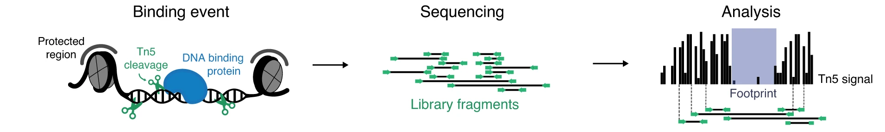
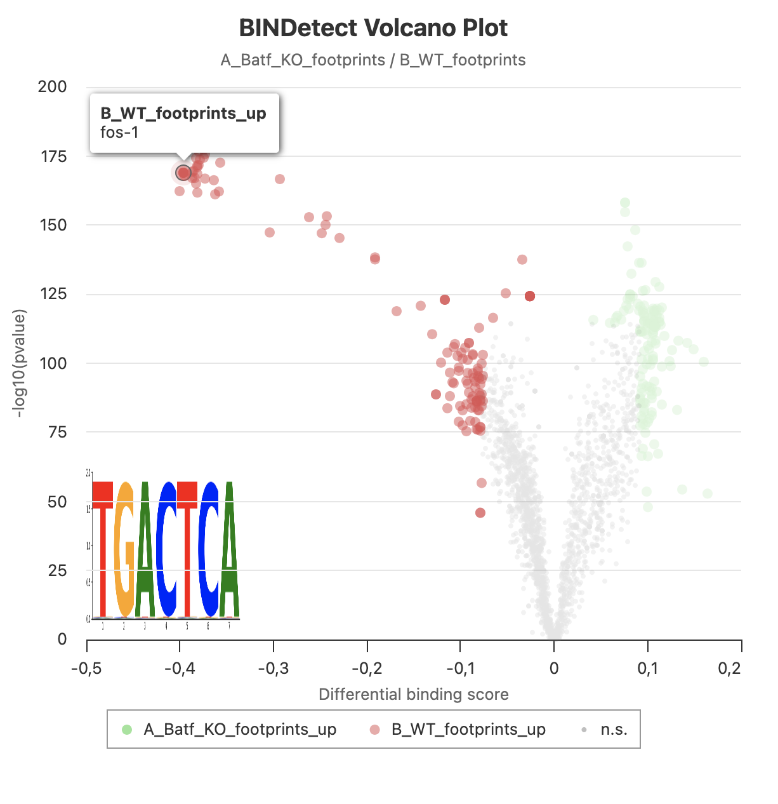

```{r echo=FALSE,include=FALSE,cache=FALSE}
library(knitr)

knitr::opts_chunk$set(echo = FALSE, 
                      collapse = TRUE, 
                      warning = FALSE, 
                      message = FALSE,
                      include=TRUE,
                      cache=FALSE,
                      out.width = "99%")

options(knitr.duplicate.label = "allow")

```

<br />

## Learning outcomes


* detect transcription factor binding signatures in ATAC-seq data

<br />


::: {#fig-1}

{width=70%}


Overview of TF footprinting in ATAC-seq data. Figure from [TOBIAS](https://github.com/loosolab/TOBIAS/wiki/).
:::

<br />
<br />


## Introduction


Transcription factor (TF) footprinting allows for the prediction of binding of a TF at a particular locus. This is because the DNA bases that are directly bound by the TF are actually protected from transposition while the DNA bases immediately adjacent to TF binding are accessible @fig-1. This results in **footprints**: defined regions of decreased signal strength within larger regions of high signal. One caveat of TF footprinting is that not all TFs leave footprints detectable in ATAC-seq data, and not all footprints for given TF can be detected.

While ATAC-seq can uncover accessible regions where transcription factors (TFs) *might* bind, reliable identification of specific TF binding sites (TFBS) still relies on chromatin immunoprecipitation methods such as ChIP-seq. 

<br />

To sum up, both approaches are complementary, and both have limitations:

* **ATAC-seq** footprinting methods require excellent data quality and deep read coverage, give evidence of *motif occupancy* rather than factor binding, and are limited to TFs which leave a footprint (estimates say of <70% TFs leaving a detectable footprint);

* **ChIP-seq** methods require high input cell numbers, are limited to one TF per assay, and are further restricted to TFs for which antibodies are available.

<br />
<br />


In this tutorial we use [TOBIAS](https://github.com/loosolab/TOBIAS/wiki/) to detect TF binding signatures in ATAC-seq data [@Bentsen2020].

<br />
<br />


## Data


We will continue using data that from publication `Batf-mediated epigenetic control of effector CD8+
T cell differentiation` (Tsao et al 2022). These are **ATAC-seq** libraries (in duplicates) prepared to analyse chromatin accessibility status in murine CD8+ T lymphocytes prior to and upon Batf knockout.

The response of naive CD8+ T cells to their cognate antigen involves rapid and broad changes to gene expression that are coupled with extensive chromatin remodeling. Basic leucine zipper ATF-like transcription
factor **Batf** is essential for the early phases of the process.


<br />
<br />


To save time, we will use *precomputed tracks* and perform the last step: **footprints detection**.

We will use motifs of **selected TFs**, to shorten the computation time.

We will inspect the results of footprinting of a comprehensive TF landscape of non-redundant vertebrate TF motif collection from [JASPAR](https://jaspar.elixir.no/) .

The starting point for this analyses are bam files with alignments **merged across replicates** i.e. one bam file per condition. This is done to increase read depth.

<br />
<br />

## Setting-up

Starting at `atacseq/analysis` we will create a dedicated directory and link and copy necessary files.


```{bash}
#| eval: FALSE
#| echo: TRUE

mkdir TF_footprinting
cd TF_footprinting

tracksdir="/proj/epi2026/TF_ftprnt/data/TF_footprinting/tracks"

ln -s "${tracksdir}/A_Batf_KO/Footprint/A_Batf_KO_footprints.bw" .
ln -s "${tracksdir}/B_WT/Footprint/B_WT_footprints.bw" .

cp /proj/epi2026/TF_ftprnt/TF_ftprnt/JASPAR2024_selTFs_pfms_meme.txt .

cp /proj/epi2026/TF_ftprnt/TF_ftprnt/genrich_joint_peaks_merged.Allpeaks_annot.Ensembl.bed .

mkdir results
cp -r /proj/epi2026/TF_ftprnt/TF_ftprnt/Batf_KO_vs_WT_selTFs  results
mkdir results/Batf_KO_vs_WT_allTFs
cp -r /proj/epi2026/TF_ftprnt/results/Batf_KO_vs_WT/BINDdetect/bindetect* results/Batf_KO_vs_WT_allTFs
```

<br />
<br />


## Detection of TF Binding Signatures

<br />

`TOBIAS` TF footprinting workflow consists of three stages:


1. Correction for the Tn5 transposase insertion sequence bias using `ATACorrect`;

2. Identify regions of protein binding in open chromatin (within peaks) using `ScoreBigwig`;

3. Calculate TF binding by combining footprint scores and TF binding motif information using `BINDetect`.


<br />
<br />

### ATACorrect and ScoreBigwig

<br />

We have precomputed these tracks, as it takes time and CPU resources.

In brief, the commands were [*do not run*]:

<br />

```{bash}
#| eval: FALSE
#| echo: TRUE

TOBIAS ATACorrect --bam B_WT_merged_replicates.sorted.bam --genome GRCm39/Mus_musculus.GRCm39.dna.primary_assembly.fa --peaks genrich_joint_peaks_merged.Allpeaks_annot.Ensembl.bed --outdir TF_footprinting/tracks/B_WT/Footprint/

TOBIAS ScoreBigwig --signal Footprint/B_WT_merged_replicates.sorted_corrected.bw --regions genrich_joint_peaks_merged.Allpeaks_annot.Ensembl.bed --output B_WT_footprints.bw

```
<br />


### TF Binding Detection


We will run `TOBIAS` `BINDetect` in **comparative mode** where we compare TF footprints in **BATF KO vs WT**.


We need to set some paths first:

<br />

```{bash}
#| eval: FALSE
#| echo: TRUE

container_pth="/proj/epi2026/library/containers/agatasm-tobias-uropa.img"

file_fa="/proj/epi2026/TF_ftprnt/ref/Mus_musculus.GRCm39.dna.primary_assembly.fa"
    
motifs_file="JASPAR2024_selTFs_pfms_meme.txt"

peaks="genrich_joint_peaks_merged.Allpeaks_annot.Ensembl.bed"

footprnt_1="A_Batf_KO_footprints.bw"
    
footprnt_2="B_WT_footprints.bw"

smpl="Batf_KO_vs_WT_selTFs"

```
<br />

We will execute `TOBIAS` in a software container:

<br />
<br />

```{bash}
#| eval: FALSE
#| echo: TRUE

projroot="/proj/epi2026/"

apptainer exec --bind $(pwd) --bind ${projroot} --pwd $(pwd) ${container_pth} \
TOBIAS  BINDetect --motifs ${motifs_file} \
  --signals ${footprnt_1} ${footprnt_2} \
  --genome ${file_fa} \
  --peaks ${peaks} \
  --cores 5 \
  --outdir ${smpl}/BINDdetect
```

<br />
<br />


Output description can be found at [BINDdetect documentation homepage](https://github.com/loosolab/TOBIAS/wiki/BINDetect#output). 

You can view summary of the results obtained for the subset JASPAR vertebrate consensus motif collection in directory `Batf_KO_vs_WT_selTFs/BINDdetect`. In particular, file `bindetect_A_Batf_KO_footprints_B_WT_footprints.html` contains an interactive volcano plot highlighting the TFs with most extreme differences in their footprint scores upon Batf knock-out. The results obtained by interrogation of the non-subset JASPAR collection are presented on @fig-2.

<br />

<br />


::: {#fig-2}

{width=70%}

Results of TF footprinting in Batf KO vs WT. Interrogated were motifs in non-subset JASPAR vertebrate consensus motif collection.
:::

<br />


**Batf** motif is part of the JUN / FOS points cluster at the top left arm of the volcano. The results for one of its motifs are:

<br />


You can inspect the results of TF footprinting using the non-subset JASPAR vertebrate consensus motif collection at `results/Batf_KO_vs_WT_allTFs`.

<br />

```{r}
#| eval: FALSE
#| echo: TRUE
#| code-overflow: scroll

output_prefix name  motif_id  cluster total_tfbs  A_Batf_KO_footprints_mean_score A_Batf_KO_footprints_bound  B_WT_footprints_mean_score  B_WT_footprints_bound A_Batf_KO_footprints_B_WT_footprints_change A_Batf_KO_footprints_B_WT_footprints_pvalue A_Batf_KO_footprints_B_WT_footprints_highlighted

BATF_MA1634.2 BATF  MA1634.2  C_FOS::JUND 17254 0.33875 2304  0.38674 2747  -0.39584  1.07531E-169  True
```

<br />

How do you interpret the TF footprinting result (the observed change in Batf motif occupancy)?


