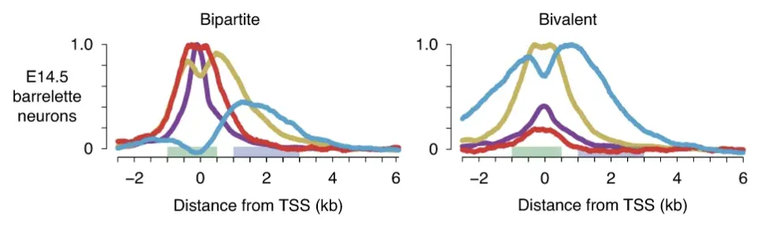

## Overview

This tutorial covers more advanced analyses pertaining to ChIP-seq data. We will examine histone modifications over time and look into how we can jointly visualize the epigenome and changes in chromatin that occur on a global level. 

### The data set

As mentioned, we will be looking at histone marks from several time points across development. For this we will be using the data generated in this study by @Kitazawa2021Polycomb. The authors describe a new epigenetic signature on genes characterized by open and H3K27-acetylated promoters (active marks) and H3K27-methylated gene bodies (repressive mark), called bipartite genes. These genes are not expressed but can be within minutes as soon as the repressive H3K27me3 mark is removed from the gene body upon exposure to the right stimulus. They tend to be transcription factors (TFs) and play key developmental roles. @fig-BipBivGene below depicts how the chromatin marks present themselves on bipartite and the previously described bivalent genes.

{#fig-BipBivGene}


```{r}
.libPaths(c("/Users/daniamachlab/Library/R/arm64/4.6-Bioc-3.23/library/", .libPaths()))
suppressPackageStartupMessages({
  library(GenomicRanges)
  library(limma)
  library(dplyr)
  library(tidyr)
  library(tibble)
  library(ggplot2)
  library(patchwork)
  library(Rtsne)
})

```


## Read in the data

Our starting point for this tutorial is two raw count matrices: one on promoters and another on gene bodies. Promoters were defined as 1kb upstream and 500 bases downstream the transcription start site (TSS) and gene bodies as regions from 1kb to 3kb downstream the TSS. The rows in these count matrices correspond to genes and the columns correspond to the different modalities quantified on the promoter and gene body level and at three different developmental time points, namely E14, E18 and P4, where E14 means day 14 at the embryonic stage and P4 means 4 days post-natally or after birth. The marks that were quantified are ATAC-seq, H3K27me3, H3K27Ac and H3K4me2. 

Let's begin by reading in the data.

```{r}
## promoters
promoters <- readRDS("dataObjects/promotersGRanges.rds")
pCnt <- readRDS("dataObjects/promotersCnt.rds")
```

Let's have a look at the objects.
```{r}
head(promoters)
```

```{r}
head(pCnt)
```


```{r}
## gene bodies
geneBodies <- readRDS("dataObjects/geneBodiesGRanges.rds")
gbCnt <- readRDS("dataObjects/geneBodiesCnt.rds")
```


::: {.callout-tip}
## Exercise
1. Examine the gene body regions and counts.
2. Pick either one of the two count matrices (promoter or gene body level) and summarize how many time points there are, how many marks are measured, and how many replicates each mark has per time point. You can make use of the `table` function to do this.
:::


## Examining the promoter H3K4Me2 count matrix 

We will focus on the promoter H3K4Me2 count matrix as an example, to illustrate how to get a global picture of our data. We want to know if there is any global non-linearitites or problems with the counts. Do we expect global shifts across time?

```{r}
#| fig-width: 10
#| fig-height: 10

# cnt <- pCnt[, grep("K4Me2", colnames(pCnt))]
# 
# pairs(cnt, panel = function(...){smoothScatter(..., nrpoints = 0, colramp = jet.colors, add=TRUE);abline(a=0,b=1,col="white")}, 
#       main = paste0("Original log2(RPKM) - ", conditions[i]))
# 

cnt <- pCnt[, grep("K4Me2", colnames(pCnt))]
cpm <- sweep(x = cnt, MARGIN = 2, 
             STATS = colSums(cnt), FUN = "/")*1e6
log2cpm <- log2(cpm + 1)

jet.colors <- colorRampPalette(c("#00007F", "blue", "#007FFF", "cyan", 
                                 "#7FFF7F", "yellow", "#FF7F00", "red", "#7F0000"))
pairs(log2cpm, panel = function(...){smoothScatter(..., nrpoints = 0, colramp = jet.colors, add=TRUE);
  abline(a=0,b=1,col="white")}, main = "Promoter log2(CPM+1)")


```


::: {.callout-tip}
## Exercise
Comment on the pairs scatter plot above. Do you notice the non-linearities between samples? Examine the count vs GC content trends per sample to see if they explain these differences. Use the `promoters` object to get the GC percent of promoters and plot the log2(cnt+1) vs percGC for each sample on the promoter level for the H3K4Me2 mark depicted above. You may refer to the previous tutorial if needed.
:::

## Correcting for non-linearities

Before doing any normalization or correction it is important to understand why you are doing this, as well as how. In our case, we have discovered that the non-linearities in the scatter plots above can be explained by the differences in GC trends between samples. These technically-caused differences in counts will drive the differences we see if we don't account for them in some way. 

We will continue with the promoter H3K4Me2 count matrix from above to illustrate the normalization procedure. We will use the `normalizeCyclicLoess` function from the `limma` package to do this. An important assumption we are making here is that we do not expect genome-wide difference between the samples we are comparing, the time points in our case, meaning that most promoters don't change over time.

So what does the function do? Briefly, the mean count across samples is calculated for all promoters. Then, for each sample, the difference from this mean is caluclated and a loess fit is done for this difference vs the mean. The fitted values are used and subtracted from the original sample counts. This is done over a few iterations, hence the name cyclic loess. See the help page as well as the code in the function for more details. We can think of it as correcting the reads towards the same count vs GC trend since this is what's driving hte non-linearities in our counts. The linear relationship between count and GC content is not removed, but the counts are moved towards the same trend. This makes the samples comparable across the same region. This is a softer approach than completely removing the linear reltionship between count and GC content. 

Let's aply this on our count matirx.
```{r}
#| fig-width: 10
#| fig-height: 10

## Normalize with cyclic loess
log2cpmNorm <- normalizeCyclicLoess(log2cpm)

## Plot the corrected counts
pairs(log2cpmNorm, panel = function(...){smoothScatter(..., nrpoints = 0, colramp = jet.colors, add=TRUE);
  abline(a=0,b=1,col="white")}, main = "Promoter Norm log2(CPM+1)")
```


::: {.callout-tip}
## Exercise
Take these corrected counts, which are corrected log2 CPM counts, and plot them against the percent GC for promoters for each sample. Do you see a change in the trends? Are they more similar than before?
:::


::: {.callout-tip}
## Exercise
Make an MA plot showing the log2 fold change vs log2 average expression for P4 vs E14. Do this using the log2cpm matrix, and using the log2cpmNorm matrix. Compare the two MA plots and what can you notice? You may refer to the first tutorial to see how we did MA plots.
:::


## RPKMs on promoters and gene bodies

Now that we have illustrated how to correct for non-linearities coming from differences in count vs GC content trends, let's create one matrix from the promoter and gene body counts. The purpose will be become apparent in the next section. The matrix we want to construct should have genes from the three developmental time points as rows, and the promoter and gene body ATAC, H3K27Me2, H3K27Ac and H3K27me3 as columns. In essence, we want to have genes as rows and the different chromatin measurements on promoter and gene body as columns for those genes, and we want to do this for each time point.

The promoters and gene bodies we defined here have different widths, so the counts will have to be corrected for both library size difference between samples, as well as width differences. We will calculate reads per kilobase per million reads (RPKM) to accomplish this.

```{r}
## Calculate RPKMs
all(colnames(pCnt) == colnames(gbCnt))
all(rownames(pCnt) == rownames(gbCnt))
libSizes <- colSums(pCnt[,-1]) + colSums(gbCnt[,-1])
pRPKM <- t(t(pCnt[,-1] / pCnt[,1] * 1000) / libSizes * 1e6)
gbRPKM <- t(t(gbCnt[,-1] / gbCnt[,1] * 1000) / libSizes * 1e6)
```

Let's calculate the average RPKM per condition (average the replicates).
```{r}
## Group by condition and calculate average rpkm per condition for each time pt.
conditions <- gsub('.{2}$', '', colnames(pRPKM))
spl <- split(colnames(pRPKM), conditions)
lengths(spl)
```


```{r}
## Average replicates per sample
pRPKMavr <- do.call(cbind, lapply(spl, function(i){rowMeans(pRPKM[, i])}))
gbRPKMavr <- do.call(cbind, lapply(spl, function(i){rowMeans(gbRPKM[, i])}))

## log2(RPKM+0.1)
log2pRPKM <- log2(pRPKMavr+0.1)
log2gbRPKM <- log2(gbRPKMavr+0.1)
```

### Normalization

Next we will use `normalizeCyclicLoess` per chromatin mark across the time points, separately for promoters and gene bodies.
```{r}
## Create groupings on which to use normalizeCyclicLoess
all(colnames(log2pRPKM) == colnames(log2gbRPKM))
conditions <- limma::strsplit2(colnames(log2pRPKM), "_")[, 3]
spl <- split(colnames(log2pRPKM), conditions)
lengths(spl)
```

```{r}
## Apply normalization per chromatin mark across conditions per P and GB
pNormL <- lapply(spl, function(timePts){
  normalizeCyclicLoess(log2pRPKM[, timePts])
})
gbNormL <- lapply(spl, function(timePts){
  normalizeCyclicLoess(log2gbRPKM[, timePts])
})
head(pNormL$K27Ac)
```

::: {.callout-tip}
## Exercise
Take a few marks of your choice on either promoter or gene body level (after normalization), and look at the pairs scatter plots. Does everything seem in order?
:::

Next, we will construct a count matrix where the columns display normalized log2 RPKMs for each mark, and the rows the genes at a specific developmental time point. We do this again for P and GB separately.
```{r}
## For each mark, haev the time points per gene as rows
pNormExpandedL <- lapply(names(pNormL), function(mark){
  normMat <- pNormL[[mark]]
  normMat %>% 
    as.data.frame() %>% 
    rownames_to_column("geneID") %>% 
    pivot_longer(cols = -geneID, names_to = "timePt", values_to = "log2rpkm") %>% 
    mutate(geneIDtimePt = paste0(geneID, "_", limma::strsplit2(timePt, "_")[, 1])) %>% 
    select(geneIDtimePt, log2rpkm) %>% 
    column_to_rownames("geneIDtimePt") %>% 
    rename(!!mark := log2rpkm)  %>% 
    as.matrix()
})
gbNormExpandedL <- lapply(names(gbNormL), function(mark){
  normMat <- gbNormL[[mark]]
  normMat %>% 
    as.data.frame() %>% 
    rownames_to_column("geneID") %>% 
    pivot_longer(cols = -geneID, names_to = "timePt", values_to = "log2rpkm") %>% 
    mutate(geneIDtimePt = paste0(geneID, "_", limma::strsplit2(timePt, "_")[, 1])) %>% 
    select(geneIDtimePt, log2rpkm) %>% 
    column_to_rownames("geneIDtimePt") %>% 
    rename(!!mark := log2rpkm)  %>% 
    as.matrix()
})

## Check the row names are identical
sapply(pNormExpandedL, function(mat){
  all(rownames(mat)==rownames(pNormExpandedL[[1]]))
})
sapply(gbNormExpandedL, function(mat){
  all(rownames(mat)==rownames(gbNormExpandedL[[1]]))
})

## Combine marks
promoterlog2RPKM <- do.call(cbind, pNormExpandedL)
geneBodylog2RPKM <- do.call(cbind, gbNormExpandedL)
head(promoterlog2RPKM)
```

Now we can combine the promoter and gene body matrices.
```{r}
## Prepare to combine
all(rownames(promoterlog2RPKM) == rownames(geneBodylog2RPKM))
colnames(promoterlog2RPKM) <- paste0(colnames(promoterlog2RPKM), "_P")
colnames(geneBodylog2RPKM) <- paste0(colnames(geneBodylog2RPKM), "_GB")

## Combine
combinedLog2RPKM <- cbind(promoterlog2RPKM, geneBodylog2RPKM)

## Fix colnames
g <- grep("^K", colnames(combinedLog2RPKM))
colnames(combinedLog2RPKM)[g] <- paste0("H3", colnames(combinedLog2RPKM)[g])
head(combinedLog2RPKM)
```

Why did we do all this? Now we have the chromatin marks of interest on the gene level, capturing quantitatively comparable promoter and gene body levels per mark over all genes. In a way we are already thinking of these different columns as dimensions in the chromatin landscape of these genes. Furthermore, the rows are showing these values for each of the three time points. This will make it possible to see how the chromatin landscape changes over time, when we compare the different time points. 

## PCA

So how can we visualize this chromatin landscape? Since we have 8 columns or dimensions which together represent the chromatin landscape we are interested in, we need to reduce this to 2 (or 3) dimensions to visualize this space. Principle component analysis (PCA) which we have already seen in the previous tutorial could be used to look at the top principle components and see if they capture most of this landscape.

Let's try this.
```{r}
## PCA
pca <- prcomp(x = combinedLog2RPKM, scale. = FALSE)
summary(pca)
```

```{r}
#| fig-width: 15
#| fig-height: 5

s <- summary(pca)
pc1var <- round(s$importance["Proportion of Variance", "PC1"]*100, digits = 2)
pc2var <- round(s$importance["Proportion of Variance", "PC2"]*100, digits = 2)
pc3var <- round(s$importance["Proportion of Variance", "PC3"]*100, digits = 2)


jet.colors <- colorRampPalette(c(
  "#00007F", "blue", "#007FFF", "cyan",
  "#7FFF7F", "yellow", "#FF7F00", "red", "#7F0000"
))

df <- cbind(data.frame(pca$x), combinedLog2RPKM) %>% 
  rownames_to_column("rowName") %>% 
  mutate(geneID = limma::strsplit2(rowName, "_")[, 1]) %>% 
  mutate(timePt = limma::strsplit2(rowName, "_")[, 2])

df %>% 
  pivot_longer(cols = starts_with(c("ATAC", "H3")), 
               names_to = "chromatinMark", values_to = "log2RPKM") %>% 
  ggplot(aes(x = PC1, y = PC2)) + 
  geom_point(aes(color = log2RPKM)) + 
  scale_color_gradientn(colors = jet.colors(100)) + 
  #coord_fixed(ratio = pc2var/pc1var) + 
  labs(x = paste0("PC1 (", pc1var, "%)"), y = paste0("PC2 (", pc2var, "%)")) +
  theme_classic() + 
  facet_wrap(~chromatinMark, ncol = 4)


```

PC1 seems to capture more accessible and active genes going to the right of the plot, where H3K27Ac gets higher. PC2 seems to capture the repressive H3K27me3 mark with more of this mark being present on genes grouped with increasing PC2. But can we get a bit of a more fine-tuned visualization of the chromatin landscape? We will next input our gene (per time point) vs PC matrix into the `Rtsne` function to produce a t-SNE plot.


## t-SNE

Let's use the matrix from the PCA (PCs as columns) to apply the t-distributed stochastic neighbor embedding, or t-SNE for short, from @vanDerMaaten2008. In contrast to the PCA, this is a stochastic and non-linear dimensionality reduction technique. The method tries to produce a lower dimensional representation of the data, maintaining as much as possible the distances between the points from the higher dimensions. What this means is taht points that are close to each other in the original high dimensional space should remain close to each other in the lower dimensional representation (2 dimensions in our case). t-SNE is commonly used in single cell RNA-seq data analysis, and it is a great way to visualize the data especially in this case where we expect a rather continuous chromatin landscape and varying degrees of the mark depositions or accessibility.


```{r}
## t-SNE
set.seed(6740)
tsne <- Rtsne(X = pca$x, pca = FALSE)
str(tsne)
```


Let's plot the t-SNE coloring by all the chromatin marks, to dry and make sense of the chromatin landscape we are seeing and if there's any structure and order to it. Note that each chromatin mark lives in its own space, meaning a count of 1 in the ATAC modality does not translate to or compare to a count of 1 in the H3K27me3 modality. They are different data types, and even amongst the ChIP-seq samples, different antibodies have different pull-down efficiencies or degrees of how well they capture the mark of interest. However with one mark, say H3K27Ac, we can indeed compare the promoter and gene body counts since we have log2 RPKM values. We will take this into account when plotting, so that the colors are directly comparable between promoter and gene body levels of a particular mark. We will also be setting lower and upper level limits so that the extreme values don't dominate the color space and we can appreciate the global differences in the marks in a more fine grained way.


```{r}
#| fig-width: 18
#| fig-height: 6

## Prepare to plot
tsneMat <- as.data.frame(tsne$Y)
colnames(tsneMat) <- c("TSNE1", "TSNE2")
df <- cbind(tsneMat, combinedLog2RPKM) %>% 
  rownames_to_column("rowName") %>% 
  mutate(geneID = limma::strsplit2(rowName, "_")[, 1]) %>% 
  mutate(timePt = limma::strsplit2(rowName, "_")[, 2])

## Plot
marks <- colnames(df)[grep("^ATAC|H3", colnames(df))]
plotList <- lapply(marks, function(mark){
  
  # get P and GB log2 RPKMs for the mark and set a lower and upper limit
  # ... limit for the colors corresponding to the bottom and top 5%
  modality <- limma::strsplit2(mark, "_")[, 1]
  values <- c(df[, paste0(modality, "_P")], df[, paste0(modality, "_GB")])
  lowerLim <- quantile(values, 0.05)
  upperLim <- quantile(values, 0.95)
  
  # plot
  ggplot(df, aes(x = TSNE1, y = TSNE2)) +
    geom_point(aes(color = .data[[mark]])) + 
    scale_color_gradientn(colors = jet.colors(100), 
                          limits = c(lowerLim, upperLim), 
                          oob = scales::squish) + 
    labs(title = mark) +
    theme_classic() 
  
})
wrap_plots(plotList, ncol = 4)
```


We can see certain patterns emerging here. The right-hand side seems to depict genes that are more active or expressed. They are high in accessibility as well as H3K27Ac. The genes on the left-hand side are almost completely inaccessible, lack the active H3K27Ac mark, and are also lacking the repressive H3K27Me3 mark. These are likely genes in the heterochromatin which is not actively used and so tightly packed that it's both inaccessible and lacking the repressive histone mark. The region in the middle, at the bottom of the t-SNE looks interesting. There is a more plastic world in between, where we see signs of both active and repressive marks co-existing to varying degrees. We will come to see later that this is where we find bipartite and bivalent genes.


::: {.callout-tip}
## Exercise
Pick a mark of your choosing, for example `ATAC_P`, and plot the t-SNE coloring by this mark. Do this with and without setting any value limits in the coloring the way we have done above, and compare the two plots. Do you notice a difference in contrast? Which do you prefer and why?
:::

::: {.callout-tip}
## Exercise
Have a look at the `df` object we made to generate the plots. You will notice that we have a column showing the time point. Plot the t-SNE coloring by the time point. Do you see an even mixing of the time points or is there a space in the t-SNE more dominated by one time point than another. What do each of those scenarios mean?
:::

### t-SNE is stochastic

Did you notice that we had to set the seed in order to obtain this exact plot. If you do not do this, you will generate a different t-SNE everytime. So it is important to set the seed in order to be able to reproduce the plot you want.

::: {.callout-tip}
## Exercise
Play with different seed values (any random number of your choosing) and generate the t-SNE and plots from above. Do you have a new favorite?
:::

Please have a look at the arguments of the `Rtsne` function and its help page. You will notice that by default, the function will perform a PCA before a t-SNE. That is why we set `pca=FALSE`. You will also notice that there are additional arguments for the t-SNE that can affect the plto we get. This includes the `perplexity` argument which controls how many nearest neighbors are taken when constructing the embedding in the lower dimensional space. See more in the Details section.

::: {.callout-tip}
## Exercise
1. Use the `Rtsne` function directly on the `combinedLog2RPKM` matrix. Do you get the same t-SNE as above? Keep in mind that you need to set the same seed. 
2. Read a little more about the perplexity parameter and vary it. What do your plots look like?
:::


### Gene expression

What about gene expression? This is not information that went into the t-SNE. If we color the genes by their expression here, does this fit our interpretation of the marks and the landscape we have seen so far?


color by rna seq
eucledian dist
bip and biv genes


::: {.callout-tip}
## Exercise
:::


## Session

```{r}
#| output-fold: true

date()
sessionInfo()
```

