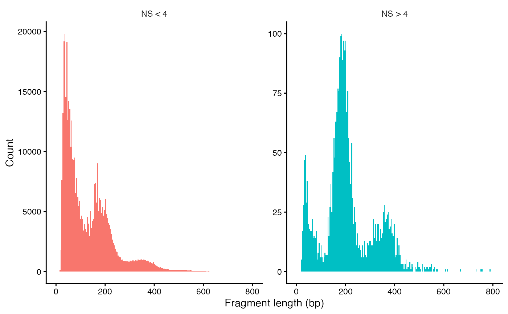

```{r echo=FALSE,include=FALSE,cache=FALSE}
library(knitr)

knitr::opts_chunk$set(echo = TRUE, 
                      collapse = TRUE, 
                      warning = FALSE, 
                      message = FALSE,
                      include=TRUE,
                      cache=FALSE,
                      out.width = "99%")

options(knitr.duplicate.label = "allow")

```


## Learning outcomes

* Apply basic steps for quality control, normalization, dimensionality reduction, clustering and visualization of single cell ATAC-seq data.

<br />
<br />

## Setting up

Today we are going to work on [Pelle](https://docs.uppmax.uu.se/cluster_guides/pelle/),
an HPC cluster hosted by [Uppmax](https://www.uu.se/centrum/uppmax/).

Please follow the setup procedure to book a node and log in to it. The following gives you access to part of a node prebooked for this workshop (5 cores per person) for 3 hours (change the time in the command below according to your plan for working).

```{bash}
#| eval: false
#| echo: true

ssh -Y <USERNAME>@pelle.uppmax.uu.se

interactive -A uppmax2026-1-197 -t 3:00:00 -c 5
```


::: {.callout-note}
  
   We take advantage of the module system on Pelle in this tutorial. The code was tested under `R 4.6.1`.

:::

We access the R environment via:

```{bash}
#| eval: FALSE
#| echo: TRUE

module load R/4.6.1-gfbf-2026.1
module load R-bundle-CRAN/2026.07-foss-2026.1
module load R-bundle-Bioconductor/3.23-foss-2026.1-R-4.6.1
```

We activate R console upon typing `R` in the terminal.

To be able to load all necessary libraries that are not available in modules, we need to update the paths to a custom library location:


```{r}
#| eval: FALSE
#| echo: TRUE

.libPaths(c(.libPaths(),"/proj/epi2026/library/Rpackages/4.6.1"))
```


::: {.callout-note}

Alternatively you can work on this tutorial locally if you have all the R packages loaded below installed on your computer.

:::

We begin by loading necessary libraries:

```{r}
#| label: libraries
#| eval: FALSE
#| echo: true

library(tidyverse)
library(hdf5r)
library(patchwork)

library(Signac)
library(Seurat)

library(biovizBase)
library(GenomeInfoDb)
library(EnsDb.Hsapiens.v75)
library(BSgenome.Hsapiens.UCSC.hg19)

library(JASPAR2020)
library(TFBSTools)
library(motifmatchr)
library(ggseqlogo)
library(betterChromVAR)
library(SummarizedExperiment)

set.seed(1234)

```

<br />
<br />

## Introduction

In this exercise we will use [Signac](https://satijalab.org/signac/index.html) to analyze scATAC/seq data. [Seurat](https://satijalab.org/seurat/) is a widely used tool to analyze scRNA-seq data. This tool has been extended to support chromatin data, *e.g.* scATAC-data, and the extension is called Signac.

We will use data from human peripheral blood mononuclear cells (PBMCs) provided by 10x Genomics. The data have already been pre-processed using CellRanger, all available through the 10x Genomics website. The starting point is a count matrix, with the number of reads in each peak in each cell along with some metadata.

<br />
<br />

## Single cell ATAC-seq data

All data for this tutorial is available on Pelle in the directory `/proj/epi2026/single_cell/scATAC/`. If you work on the tutorial locally, you need to download the data and modify the path below according to your directory structure.

```{r}
#| eval: FALSE
#| echo: true

data.dir="/proj/epi2026/single_cell/scATAC/"

```

<br />

### Loading scATAC-seq data

The ATAC-seq data consist of four files that were created with CellRanger.

- **A count file**. The rows are regions (peaks) and the columns are cells. Each entry *i,j* is the number of reads mapping to region *i* in cell *j*.

- **A metadata file** with some overall statistics for each cell.

- **A fragment file** with information on all sequenced fragments (where it maps to the genome, which cell barcode it is associated with, and how many PCR duplicates were found).

- **An index file** connected to the fragment file. This is like an index file for a bam file, to make it possible to quickly find fragments for a certain genomic region, without having to search the entire file.

The PBMC data set used here contains ATAC-seq data for 80234 regions in 9277 cells. To make the commands in this exercise run a bit faster, we will only analyze a set of 2000 (randomly selected) cells. If you have the time and interest, you can analyze the full data set by commenting out the corresponding line of code.

Here, we create a `ChromatinAssay` object from the count matrix (and a link to the fragment file). This object stores the genomic regions, count data, and also possibly gene annotations and information on sequence motifs. There are many ways to interact with a `ChromatinAssay` object.

We then create a `Seurat` object from the `ChromatinAssay`, together with metadata about cells and gene annotations.

```{r}
#| eval: FALSE
#| echo: true

counts <- Read10X_h5(filename = paste0(data.dir,"data/atac_v1_pbmc_10k_filtered_peak_bc_matrix.h5"))
# Only use 2000 cells, to make commands run faster.
counts <- counts[, sample(ncol(counts), 2000)] 

metadata <- read.csv(
    file = paste0(data.dir,"data/atac_v1_pbmc_10k_singlecell.csv"),
    header = TRUE,
    row.names = 1
)

# Cells with less than 200 features and features detected in less than 10 cells are filtered out already here.
chrom_assay <- CreateChromatinAssay(
    counts = counts,
    sep = c(":", "-"),
    genome = 'hg19', fragments = paste0(data.dir,'data/atac_v1_pbmc_10k_fragments.tsv.gz'),
    min.cells = 10,
    min.features = 200
)

pbmc <- CreateSeuratObject(
    counts = chrom_assay,
    assay = "peaks",
    meta.data = metadata
)

# Extract gene annotations from EnsDb
annotations <- GetGRangesFromEnsDb(ensdb = EnsDb.Hsapiens.v75)

# Change to UCSC style since the data was mapped to hg19
seqlevelsStyle(annotations) <- 'UCSC'
genome(annotations) <- "hg19"

# Add the gene information to the object
Annotation(pbmc) <- annotations

# Inspect the objects we have created
pbmc
pbmc[['peaks']]
granges(pbmc)
```

How many ATAC-seq regions do you have now in your `Seurat` object?

<br />

### Quality control

The next step is to do some quality control (QC) on the ATAC-seq data. There are several quality measures to consider:

- **Nucleosome banding pattern**. The histogram of DNA fragment sizes (determined from the paired-end sequencing reads) should exhibit a strong nucleosome banding pattern corresponding to the length of DNA wrapped around a single nucleosome. We calculate this per single cell, and quantify the approximate ratio of mononucleosomal to nucleosome-free fragments (stored as nucleosome_signal)

- **Transcriptional start site (TSS) enrichment score**. The [ENCODE project](https://www.encodeproject.org) has defined an ATAC-seq targeting score based on the ratio of fragments centered at the TSS to fragments in TSS-flanking regions (see https://www.encodeproject.org/data-standards/terms/). Poor ATAC-seq experiments typically will have a low TSS enrichment score. We can compute this metric for each cell with the TSSEnrichment() function, and the results are stored in metadata under the column name TSS.enrichment.

- **Number of fragments in peaks**. A measure of cellular sequencing depth / complexity. Cells with very few reads may need to be excluded due to low sequencing depth. Cells with extremely high levels may represent doublets, nuclei clumps, or other artefacts

- **Fraction of reads in peaks**. Represents the fraction of all fragments that fall within ATAC-seq peaks. Cells with low values (i.e. <15-20%) often represent low-quality cells or technical artifacts that should be removed. Note that this value can be sensitive to the set of peaks used.

- **Reads in blacklist regions.** The [ENCODE](https://www.encodeproject.org) project has defined lists of [blacklist regions](https://github.com/Boyle-Lab/Blacklist). These are problematic regions (typically repeats) that often have high signals in next-generation sequencing experiments regardless of cell line or experiment. Cells with a relatively high ratio of reads mapping to blacklist regions, compared to peaks, often represent technical artifacts and should be removed.

This may take a while to run (up to 10 minutes).

```{r}
#| eval: FALSE
#| echo: true

# Compute nucleosome signal score per cell
pbmc <- NucleosomeSignal(object = pbmc)

# Compute TSS enrichment score per cell
pbmc <- TSSEnrichment(object = pbmc, fast = FALSE)

# Add blacklist ratio and fraction of reads in peaks
pbmc$pct_reads_in_peaks <- pbmc$peak_region_fragments / pbmc$passed_filters * 100
pbmc$blacklist_ratio <- pbmc$blacklist_region_fragments / pbmc$peak_region_fragments

```

The relationship between variables stored in the object metadata can be visualized using the `DensityScatter()` function. This can also be used to quickly find suitable cutoff values for different QC metrics by setting `quantiles=TRUE`.

```{r}
#| eval: FALSE
#| echo: true

DensityScatter(pbmc, x = 'nCount_peaks', y = 'TSS.enrichment', log_x = TRUE, quantiles = TRUE)

```


```{r}
#| eval: FALSE
#| echo: true
pbmc$high.tss <- ifelse(pbmc$TSS.enrichment > 2, 'High', 'Low')
TSSPlot(pbmc, group.by = 'high.tss') + NoLegend()
```

We can also look at the fragment length periodicity for all the cells, and group by cells with high or low nucleosomal signal strength. You can see that cells that are outliers for the mononucleosomal / nucleosome-free ratio have different nucleosomal banding patterns. The remaining cells exhibit a pattern that is typical for a successful ATAC-seq experiment.

```{r}
#| eval: FALSE
#| echo: true

pbmc$nucleosome_group <- ifelse(pbmc$nucleosome_signal > 4, 'NS > 4', 'NS < 4')
FragmentHistogram(object = pbmc, group.by = 'nucleosome_group')
```

Since the plot with only 2000 cells can be a bit sparse, here is a plot for the larger data set.



Violin plots can be used to plot the distribution of different QC metrics.

```{r}
#| eval: FALSE
#| echo: true

VlnPlot(
    object = pbmc,
    features = c('pct_reads_in_peaks', 'peak_region_fragments',
                 'TSS.enrichment', 'blacklist_ratio', 'nucleosome_signal'),
    pt.size = 0.01,
    ncol = 3
) & FontSize(main = 8) & theme(axis.text.x = element_blank())  & theme(axis.title.x = element_blank()) & theme(axis.text.y = element_text(size = 6))
```


After calculating the quality statistics, we apply (some rather arbitrary) cutoffs, to remove outlier cells.


```{r}
#| eval: FALSE
#| echo: true

pbmc <- subset(
    x = pbmc,
    subset = peak_region_fragments > 3000 &
             peak_region_fragments < 20000 &
             pct_reads_in_peaks > 15 &
             blacklist_ratio < 0.05 &
             nucleosome_signal < 4 &
             TSS.enrichment > 2
)
pbmc
```

*How many cells do we have left after quality filtering in this example?*

<br />

### Normalization and initial dimensionality reduction

**Normalization:** `Signac` performs term frequency-inverse document frequency (TF-IDF) normalization. This is a two-step normalization procedure, often used in natural language processing, that both normalizes across cells to correct for differences in sequencing depth, and across peaks to give higher values to more rare peaks.

**Feature selection:** The low dynamic range of scATAC-seq data makes it challenging to perform variable feature selection, as we do for scRNA-seq. Instead, we can choose to use only the top n% of features (peaks) for dimensional reduction, or remove features present in less than n cells with the FindTopFeatures() function. Here we will use all feature (try setting min.cutoff to ‘q75’ if you only want to use the top 25% all peaks). Features used for dimensional reduction are automatically set as VariableFeatures() for the Seurat object by this function.

**Dimension reduction:** We next run singular value decomposition (SVD) on the normalized data matrix, using the features (peaks) selected above. This returns a reduced dimension representation of the matrix, similar to the output of PCA.

From the singular value decomposition, we get a set of components. The first of these components often correlates with sequencing depth, rather than any biologically meaningful signal. We can therefore remove this component in the following analysis.

```{r}
#| eval: FALSE
#| echo: true

pbmc <- RunTFIDF(pbmc)
pbmc <- FindTopFeatures(pbmc, min.cutoff = 'q0')
pbmc <- RunSVD(pbmc)

DepthCor(pbmc)
```

<br />
<br />

## Clustering and further dimensionality reduction

Now, we can cluster the cells to find groups that belong to the same cell types. It is possible to plot the results from the SVD, but these often are not informative. Instead, we use the UMAP algorithm, which shows a better separation between the cell types. If you are interested, the paper describing UMAP can be found [here](https://arxiv.org/abs/1802.03426).

```{r}
#| eval: FALSE
#| echo: true

pbmc <- RunUMAP(object = pbmc, reduction = 'lsi', dims = 2:34)
pbmc <- FindNeighbors(object = pbmc, reduction = 'lsi', dims = 2:34, k.param=13)
pbmc <- FindClusters(object = pbmc, verbose = FALSE)

p1 <- DimPlot(object = pbmc, label = TRUE, dims = c(2, 3), reduction = "lsi") +
    NoLegend()  +
    ggtitle('SVD')

p2 <- DimPlot(object = pbmc, label = TRUE) +
    NoLegend() +
    ggtitle('UMAP')

p1 | p2
```

<br />
<br />

## Save object for the next tutorial

At this step you can save your data, so you don't have to re-run all your analysis for the next tutorial. To load the data later, type `load(file="pbmc.Rda")`.

```{r}
#| eval: FALSE
#| echo: TRUE

save(pbmc, file="pbmc.Rda")
```

::: {.callout-important collapse="false"}

The `pbmc.Rda` file has to be loaded in the same file structure you are saving it on. Otherwise things will not work since Seurat Objects with fragments from ATAC-seq are not self contained, they contain paths to files with fragments and their indexes.

:::

<br />
<br />

## Motif analysis

We can also analyze motif occurrence in the peaks, to see how this varies between the different cell types.

<br />

### Identifying enriched motifs

First, we will look at motifs that are enriched in a set of peaks, *e.g.* in peaks that show differential accessibility between two cell types (clusters).


```{r}
#| eval: FALSE
#| echo: true

# Get a list of motif position frequency matrices from the JASPAR database
pfm <- getMatrixSet(
    x = JASPAR2020,
    opts = list(species = "Homo sapiens", all_versions = FALSE)
)

# Scan the DNA sequence of each peak for the presence of each motif
motif.matrix <- CreateMotifMatrix(
    features = granges(pbmc$peaks),
    pwm = pfm,
    genome = 'hg19',
    use.counts = FALSE
)
dim(motif.matrix)
as.matrix(motif.matrix[1:10,1:10])
```


```{r}
#| eval: FALSE
#| echo: true

# Create a new Motif object to store the results
motif <- CreateMotifObject(
    data = motif.matrix,
    pwm = pfm
)

# Add the Motif object to the assay
pbmc[["peaks"]]@motifs <- motif

pbmc$peaks@motifs

# Calculate statistics for each peak: GC content, length, dinucleotide frequencies etc.
# These are used in the test of motif enrichment
pbmc$peaks <- RegionStats(object = pbmc$peaks, genome = BSgenome.Hsapiens.UCSC.hg19)

# Find differentially accessible peaks in cluster 0 compared to cluster 1
da_peaks <- FindMarkers(
    object = pbmc,
    ident.1 = "0",
    ident.2 = "1",
    only.pos = TRUE,
    min.pct = 0.2,
    test.use = 'LR',
    latent.vars = 'peak_region_fragments'
)


# Get the top differentially accessible peaks, with lowest p-values
top.da.peak <- rownames(da_peaks[da_peaks$p_val < 1e-20, ])

# Find motifs enriched in these top differentially accessible peaks
enriched.motifs <- FindMotifs(
    object = pbmc,
    features = top.da.peak
)
head(enriched.motifs)
```

```{r}
#| eval: FALSE
#| echo: true

# Have a look at the most enriched motifs. Do you anything particular about these motifs?
MotifPlot(
    object = pbmc,
    motifs = head(rownames(enriched.motifs))
)
```

*Do you notice anything particular about these motifs?*

<br />

### Motif activity scores

We can also compute a per-cell motif activity score by running (better)ChromVAR. The motif activity score for a motif M is based on the number of reads mapping to peaks with motif M, after normalization correction for various biases: GC content, average number of reads mapping across all cells etc. You can read more about chromVar [here](https://www.nature.com/articles/nmeth.4401). Motif activity scores allow us to visualize motif activities per cell.

It is also possible to directly test for differential activity scores between cell types (cluster), without looking at peaks with differential binding. This tends to give similar results as performing an enrichment test on differentially accessible peaks (shown above) between the cell types (clusters).


```{r}
#| eval: FALSE
#| echo: true

# Use betterChromVAR to calculate the motif activities of all motifs in all cells.

# A SummarizedExperiment is required by betterChromVAR

DefaultAssay(pbmc) <- "peaks"
counts_mat <- GetAssayData(pbmc, layer = "counts")
seurat_obj <- RegionStats(pbmc, genome = BSgenome.Hsapiens.UCSC.hg19) 
region_stats <- GetAssayData(seurat_obj, layer = "meta.features")

# Extract peak x motif binary sparse matrix from Seurat's motif object
motif_mat <- GetMotifData(seurat_obj, layer = "motif.matrix")

# Build SummarizedExperiment
se_object <- SummarizedExperiment(
  assays = list(counts = counts_mat),
  rowData = region_stats
)

# Ensure the bias column exists (Signac stores 'pct_GC' or similar)
# betterChromVAR looks for a 'bias' column
rowData(se_object)$bias <- rowData(se_object)$GC.percent

bcv_results <- betterChromVAR(
  object = se_object,
  annotations = motif_mat,
  verbose = TRUE
)
deviation_scores <- assays(bcv_results)$deviations


# Create a new Seurat Assay structure for the deviations
chromvar_assay <- CreateAssayObject(counts = deviation_scores)
# Add the assay to your original object
pbmc[["better_chromvar"]] <- chromvar_assay


# Look at results
pbmc$better_chromvar
GetAssayData(pbmc$better_chromvar)[1:10,1:3]

# Have a look at the activitiy of the FOS motif, which has id MA0476.1
DefaultAssay(pbmc) <- 'better_chromvar'
FeaturePlot(
    object = pbmc,
    features = "MA0476.1",
    min.cutoff = 'q10',
    max.cutoff = 'q90',
    pt.size = 0.1
)
```

```{r}
#| eval: FALSE
#| echo: true

# Look for motifs that have differential activity between clusters 0 and 1.
differential.activity <- FindMarkers(
    object = pbmc,
    ident.1 = '0',
    ident.2 = '1',
    only.pos = TRUE,
    test.use = 'LR',
    min.pct = 0.2,
    latent.vars = 'nCount_peaks'
)

MotifPlot(
    object = pbmc,
    motifs = head(rownames(differential.activity)),
    assay = 'peaks'
)
```


